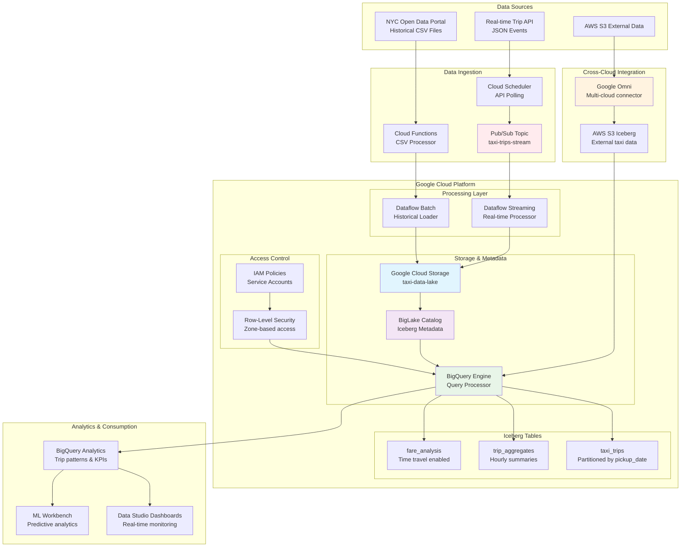

# Google BigLake Iceberg Data System
## Product Requirements Document

### Version: 1.0
### Date: June 2025
### Author: Principal Data Engineer

---

## 1. Executive Summary

This document outlines the requirements for building a modern data lake system using Google BigLake as the metadata catalog for Apache Iceberg tables, with data files stored on Google Cloud Storage. The system will support real-time data ingestion via Pub/Sub and Dataflow, advanced data operations, and cross-cloud capabilities with AWS S3 integration.

## 2. System Overview

The proposed system leverages Google Cloud Platform's BigLake service to manage Apache Iceberg tables, providing:
- Unified metadata management
- Fine-grained access control
- Cross-cloud data federation
- Real-time and batch processing capabilities
- Advanced analytical features (time travel, schema evolution)

### 2.1 Reference Dataset: NYC Taxi Trip Data

We'll use the **NYC Taxi Trip Record dataset** as our primary example, which provides:
- **Historical Data**: 15+ years of taxi trip records (2009-2024)
- **Real-time Simulation**: Live trip completion events via API polling
- **Rich Schema**: Pickup/dropoff locations, timestamps, fares, distances
- **Natural Partitioning**: By pickup date for optimal performance
- **Large Volume**: Millions of records per month for performance testing

**Data Sources:**
- **Batch**: NYC.gov Open Data Portal (historical CSV files)
- **Streaming**: Simulated real-time trips via scheduled API calls and Pub/Sub publishing

### 2.2 Architecture Diagram



## 3. Functional Requirements

### 3.1 Core Data Management
- **FR-001**: BigLake shall serve as the primary metadata catalog for Iceberg tables
- **FR-002**: Data files shall be stored as Parquet format in Google Cloud Storage
- **FR-003**: Row-level permissions shall be managed at BigQuery/BigLake level
- **FR-004**: System shall support real-time data ingestion via Pub/Sub and Dataflow
- **FR-005**: System shall support batch data processing and loading

### 3.2 Data Operations
- **FR-006**: Support INSERT, UPDATE, DELETE operations on Iceberg tables
- **FR-007**: Implement partitioning and clustering strategies
- **FR-008**: Support predicate pushdown for efficient querying
- **FR-009**: Provide time travel capabilities for historical data access
- **FR-010**: Enable schema evolution without breaking existing queries

### 3.3 Cross-Cloud Integration
- **FR-011**: Support Google Omni for managing Iceberg tables with data in AWS S3
- **FR-012**: Maintain unified metadata catalog across cloud providers

### 3.4 Performance & Optimization
- **FR-013**: Implement automatic file compaction
- **FR-014**: Support Z-ordering for optimal data layout
- **FR-015**: Provide query performance monitoring and optimization recommendations

## 4. Technical Architecture

### 4.1 Infrastructure Components

```yaml
# terraform/main.tf - Core Infrastructure
terraform {
  required_version = ">= 1.0"
  required_providers {
    google = {
      source  = "hashicorp/google"
      version = "~> 4.0"
    }
  }
}

provider "google" {
  project = var.project_id
  region  = var.region
}

# BigLake Connection for GCS
resource "google_biglake_catalog" "iceberg_catalog" {
  name     = "iceberg-catalog"
  location = var.region
}

# Cloud Storage Bucket for Iceberg data
resource "google_storage_bucket" "iceberg_data" {
  name          = "${var.project_id}-iceberg-data"
  location      = var.region
  storage_class = "STANDARD"
  
  versioning {
    enabled = true
  }
  
  lifecycle_rule {
    condition {
      age = 30
    }
    action {
      type = "SetStorageClass"
      storage_class = "NEARLINE"
    }
  }
}

# Pub/Sub Topic for real-time data
resource "google_pubsub_topic" "data_ingestion" {
  name = "data-ingestion-topic"
  
  message_storage_policy {
    allowed_persistence_regions = [var.region]
  }
}

# Dataflow service account
resource "google_service_account" "dataflow_sa" {
  account_id   = "dataflow-service-account"
  display_name = "Dataflow Service Account"
}

# IAM bindings for BigLake access
resource "google_project_iam_member" "dataflow_biglake" {
  project = var.project_id
  role    = "roles/biglake.admin"
  member  = "serviceAccount:${google_service_account.dataflow_sa.email}"
}
```

### 4.2 Configuration Management

```yaml
# config/system.yaml
iceberg:
  catalog:
    name: "iceberg-catalog"
    location: "us-central1"
  
  storage:
    bucket: "project-iceberg-data"
    path_prefix: "iceberg-tables"
  
  table_properties:
    write.format.default: "parquet"
    write.parquet.compression-codec: "snappy"
    write.metadata.compression-codec: "gzip"

dataflow:
  region: "us-central1"
  machine_type: "n1-standard-4"
  max_workers: 10
  
pubsub:
  subscription: "data-ingestion-subscription"
  ack_deadline: 600

security:
  row_level_security: true
  column_level_security: true
  data_classification: true
```

## 5. Implementation Examples

### 5.1 Iceberg Table Creation - NYC Taxi Dataset

```sql
-- Create main taxi trips Iceberg table in BigQuery using BigLake
CREATE TABLE `project.taxi_dataset.taxi_trips`
(
  trip_id STRING,
  vendor_id INT64,
  pickup_datetime TIMESTAMP,
  dropoff_datetime TIMESTAMP,
  passenger_count INT64,
  trip_distance NUMERIC,
  pickup_longitude NUMERIC,
  pickup_latitude NUMERIC,
  dropoff_longitude NUMERIC,
  dropoff_latitude NUMERIC,
  payment_type STRING,
  fare_amount NUMERIC,
  extra NUMERIC,
  mta_tax NUMERIC,
  tip_amount NUMERIC,
  tolls_amount NUMERIC,
  total_amount NUMERIC,
  pickup_location_id INT64,
  dropoff_location_id INT64,
  created_at TIMESTAMP DEFAULT CURRENT_TIMESTAMP()
)
PARTITION BY DATE(pickup_datetime)
CLUSTER BY pickup_location_id, payment_type
OPTIONS (
  table_format = 'ICEBERG',
  storage_uri = 'gs://project-iceberg-data/taxi_trips',
  description = 'NYC Taxi trip records with Iceberg format'
);

-- Create aggregated table for hourly statistics
CREATE TABLE `project.taxi_dataset.hourly_trip_stats`
(
  stat_hour TIMESTAMP,
  pickup_location_id INT64,
  trip_count INT64,
  avg_fare_amount NUMERIC,
  avg_trip_distance NUMERIC,
  avg_trip_duration_minutes NUMERIC,
  total_revenue NUMERIC,
  created_at TIMESTAMP DEFAULT CURRENT_TIMESTAMP()
)
PARTITION BY DATE(stat_hour)
CLUSTER BY pickup_location_id
OPTIONS (
  table_format = 'ICEBERG',
  storage_uri = 'gs://project-iceberg-data/hourly_trip_stats'
);

-- Create location lookup table
CREATE TABLE `project.taxi_dataset.taxi_zones`
(
  location_id INT64,
  borough STRING,
  zone_name STRING,
  service_zone STRING,
  geometry STRING,
  created_at TIMESTAMP DEFAULT CURRENT_TIMESTAMP()
)
OPTIONS (
  table_format = 'ICEBERG',
  storage_uri = 'gs://project-iceberg-data/taxi_zones'
);
```

### 5.2 Data Processing Pipelines

#### 5.2.1 Historical Batch Processing Pipeline

```python
# dataflow/batch_taxi_processor.py
import apache_beam as beam
from apache_beam.options.pipeline_options import PipelineOptions
from apache_beam.io import ReadFromText
from apache_beam.io.gcp.bigquery import WriteToBigQuery
import csv
import io
from datetime import datetime

class ParseTaxiRecord(beam.DoFn):
    def process(self, element):
        """Parse CSV record and validate taxi trip data."""
        try:
            # Parse CSV line
            reader = csv.reader(io.StringIO(element))
            row = next(reader)
            
            # NYC Taxi CSV schema mapping
            record = {
                'vendor_id': int(row[0]) if row[0] else None,
                'pickup_datetime': datetime.strptime(row[1], '%Y-%m-%d %H:%M:%S').isoformat(),
                'dropoff_datetime': datetime.strptime(row[2], '%Y-%m-%d %H:%M:%S').isoformat(),
                'passenger_count': int(row[3]) if row[3] else 1,
                'trip_distance': float(row[4]) if row[4] else 0.0,
                'pickup_longitude': float(row[5]) if row[5] else None,
                'pickup_latitude': float(row[6]) if row[6] else None,
                'dropoff_longitude': float(row[9]) if row[9] else None,
                'dropoff_latitude': float(row[10]) if row[10] else None,
                'payment_type': row[11] if row[11] else 'Unknown',
                'fare_amount': float(row[12]) if row[12] else 0.0,
                'extra': float(row[13]) if row[13] else 0.0,
                'mta_tax': float(row[14]) if row[14] else 0.0,
                'tip_amount': float(row[15]) if row[15] else 0.0,
                'tolls_amount': float(row[16]) if row[16] else 0.0,
                'total_amount': float(row[17]) if row[17] else 0.0,
                'trip_id': f"batch_{row[0]}_{row[1]}_{row[5]}_{row[6]}",
                'created_at': datetime.now().isoformat()
            }
            
            # Data validation
            if (record['pickup_datetime'] and record['dropoff_datetime'] and 
                record['trip_distance'] > 0 and record['total_amount'] > 0):
                yield record
            else:
                yield beam.pvalue.TaggedOutput('invalid', {'error': 'Invalid trip data', 'row': row})
                
        except Exception as e:
            yield beam.pvalue.TaggedOutput('invalid', {'error': str(e), 'row': element})

def run_batch_pipeline(input_files, project_id, dataset_id):
    """Process historical NYC taxi data files."""
    
    pipeline_options = PipelineOptions([
        '--runner=DataflowRunner',
        f'--project={project_id}',
        '--region=us-central1',
        '--temp_location=gs://temp-bucket/dataflow-temp',
        '--staging_location=gs://temp-bucket/dataflow-staging',
        '--max_num_workers=20',
        '--machine_type=n1-standard-4'
    ])
    
    with beam.Pipeline(options=pipeline_options) as pipeline:
        
        # Read CSV files from GCS
        raw_data = (
            pipeline
            | 'Read CSV Files' >> ReadFromText(input_files, skip_header_lines=1)
        )
        
        # Parse and validate records
        processed = (
            raw_data
            | 'Parse Records' >> beam.ParDo(ParseTaxiRecord()).with_outputs(
                'invalid', main='valid'
            )
        )
        
        # Write valid records to Iceberg table
        (
            processed.valid
            | 'Write to Iceberg' >> WriteToBigQuery(
                table=f'{project_id}.{dataset_id}.taxi_trips',
                write_disposition=beam.io.BigQueryDisposition.WRITE_APPEND,
                create_disposition=beam.io.BigQueryDisposition.CREATE_NEVER
            )
        )
        
        # Write invalid records to error table
        (
            processed.invalid
            | 'Write Errors' >> WriteToBigQuery(
                table=f'{project_id}.{dataset_id}.processing_errors',
                write_disposition=beam.io.BigQueryDisposition.WRITE_APPEND
            )
        )

if __name__ == '__main__':
    run_batch_pipeline(
        input_files='gs://nyc-tlc/trip_data/yellow_tripdata_*.csv',
        project_id='your-project-id',
        dataset_id='taxi_dataset'
    )
```

#### 5.2.2 Real-time Streaming Pipeline

```python
# dataflow/streaming_taxi_processor.py
import apache_beam as beam
from apache_beam.options.pipeline_options import PipelineOptions
from apache_beam.io.gcp.pubsub import ReadFromPubSub
from apache_beam.io.gcp.bigquery import WriteToBigQuery
import json
from datetime import datetime
import uuid

class ProcessLiveTaxiTrip(beam.DoFn):
    def process(self, element):
        """Process real-time taxi trip completion events."""
        try:
            # Parse JSON message from Pub/Sub
            trip_data = json.loads(element.decode('utf-8'))
            
            # Enrich with processing metadata
            record = {
                'trip_id': trip_data.get('trip_id', str(uuid.uuid4())),
                'vendor_id': trip_data.get('vendor_id', 1),
                'pickup_datetime': trip_data['pickup_datetime'],
                'dropoff_datetime': trip_data['dropoff_datetime'],
                'passenger_count': trip_data.get('passenger_count', 1),
                'trip_distance': float(trip_data.get('trip_distance', 0)),
                'pickup_longitude': float(trip_data.get('pickup_longitude', 0)),
                'pickup_latitude': float(trip_data.get('pickup_latitude', 0)),
                'dropoff_longitude': float(trip_data.get('dropoff_longitude', 0)),
                'dropoff_latitude': float(trip_data.get('dropoff_latitude', 0)),
                'payment_type': trip_data.get('payment_type', 'card'),
                'fare_amount': float(trip_data.get('fare_amount', 0)),
                'extra': float(trip_data.get('extra', 0)),
                'mta_tax': float(trip_data.get('mta_tax', 0.5)),
                'tip_amount': float(trip_data.get('tip_amount', 0)),
                'tolls_amount': float(trip_data.get('tolls_amount', 0)),
                'total_amount': float(trip_data.get('total_amount', 0)),
                'pickup_location_id': trip_data.get('pickup_location_id'),
                'dropoff_location_id': trip_data.get('dropoff_location_id'),
                'created_at': datetime.now().isoformat()
            }
            
            # Validate essential fields
            if (record['pickup_datetime'] and record['dropoff_datetime'] and
                record['total_amount'] > 0):
                yield record
            else:
                yield beam.pvalue.TaggedOutput('dead_letter', record)
                
        except Exception as e:
            yield beam.pvalue.TaggedOutput('dead_letter', {
                'error': str(e), 
                'message': element.decode('utf-8', errors='ignore')
            })

class CalculateHourlyStats(beam.DoFn):
    def process(self, element, window=beam.DoFn.WindowParam):
        """Calculate hourly aggregations for real-time monitoring."""
        
        pickup_time = datetime.fromisoformat(element['pickup_datetime'].replace('Z', '+00:00'))
        stat_hour = pickup_time.replace(minute=0, second=0, microsecond=0)
        
        yield {
            'stat_hour': stat_hour.isoformat(),
            'pickup_location_id': element.get('pickup_location_id', 0),
            'trip_count': 1,
            'total_fare': element['fare_amount'],
            'total_distance': element['trip_distance'],
            'trip_duration_minutes': self._calculate_duration(element),
            'created_at': datetime.now().isoformat()
        }
    
    def _calculate_duration(self, trip):
        """Calculate trip duration in minutes."""
        pickup = datetime.fromisoformat(trip['pickup_datetime'].replace('Z', '+00:00'))
        dropoff = datetime.fromisoformat(trip['dropoff_datetime'].replace('Z', '+00:00'))
        return (dropoff - pickup).total_seconds() / 60

def run_streaming_pipeline(project_id, subscription_name, dataset_id):
    """Process real-time taxi trip events."""
    
    pipeline_options = PipelineOptions([
        '--runner=DataflowRunner',
        f'--project={project_id}',
        '--region=us-central1',
        '--streaming=true',
        '--temp_location=gs://temp-bucket/dataflow-temp',
        '--staging_location=gs://temp-bucket/dataflow-staging',
        '--max_num_workers=10',
        '--autoscaling_algorithm=THROUGHPUT_BASED'
    ])
    
    with beam.Pipeline(options=pipeline_options) as pipeline:
        
        # Read from Pub/Sub subscription
        messages = (
            pipeline
            | 'Read from Pub/Sub' >> ReadFromPubSub(
                subscription=f'projects/{project_id}/subscriptions/{subscription_name}'
            )
        )
        
        # Process trip completion events
        processed_trips = (
            messages
            | 'Process Trip Events' >> beam.ParDo(ProcessLiveTaxiTrip()).with_outputs(
                'dead_letter', main='processed'
            )
        )
        
        # Write individual trips to Iceberg table
        (
            processed_trips.processed
            | 'Write Trips to Iceberg' >> WriteToBigQuery(
                table=f'{project_id}.{dataset_id}.taxi_trips',
                write_disposition=beam.io.BigQueryDisposition.WRITE_APPEND
            )
        )
        
        # Calculate and write hourly stats
        hourly_stats = (
            processed_trips.processed
            | 'Window into Hours' >> beam.WindowInto(beam.window.FixedWindows(3600))  # 1 hour
            | 'Calculate Stats' >> beam.ParDo(CalculateHourlyStats())
            | 'Group by Location' >> beam.GroupBy('stat_hour', 'pickup_location_id')
            | 'Aggregate Stats' >> beam.Map(lambda group: {
                'stat_hour': group.key[0],
                'pickup_location_id': group.key[1],
                'trip_count': sum(item['trip_count'] for item in group.value),
                'avg_fare_amount': sum(item['total_fare'] for item in group.value) / len(group.value),
                'avg_trip_distance': sum(item['total_distance'] for item in group.value) / len(group.value),
                'avg_trip_duration_minutes': sum(item['trip_duration_minutes'] for item in group.value) / len(group.value),
                'total_revenue': sum(item['total_fare'] for item in group.value),
                'created_at': datetime.now().isoformat()
            })
        )
        
        (
            hourly_stats
            | 'Write Stats to Iceberg' >> WriteToBigQuery(
                table=f'{project_id}.{dataset_id}.hourly_trip_stats',
                write_disposition=beam.io.BigQueryDisposition.WRITE_APPEND
            )
        )
        
        # Handle dead letter queue
        (
            processed_trips.dead_letter
            | 'Write Dead Letters' >> WriteToBigQuery(
                table=f'{project_id}.{dataset_id}.processing_errors',
                write_disposition=beam.io.BigQueryDisposition.WRITE_APPEND
            )
        )

if __name__ == '__main__':
    run_streaming_pipeline(
        project_id='your-project-id',
        subscription_name='taxi-trips-subscription',
        dataset_id='taxi_dataset'
    )
```

#### 5.2.3 Real-time Data Generator

```python
# data_generator/taxi_trip_simulator.py
import json
import random
import time
from datetime import datetime, timedelta
from google.cloud import pubsub_v1
import requests
import uuid

class TaxiTripSimulator:
    def __init__(self, project_id, topic_name):
        self.project_id = project_id
        self.topic_name = topic_name
        self.publisher = pubsub_v1.PublisherClient()
        self.topic_path = self.publisher.topic_path(project_id, topic_name)
        
        # NYC taxi zone coordinates (sample locations)
        self.pickup_locations = [
            {'id': 161, 'lat': 40.7589, 'lon': -73.9851, 'name': 'Midtown Center'},
            {'id': 237, 'lat': 40.7505, 'lon': -73.9934, 'name': 'Times Square'},
            {'id': 186, 'lat': 40.6781, 'lon': -73.9442, 'name': 'Brooklyn Heights'},
            {'id': 132, 'lat': 40.7831, 'lon': -73.9712, 'name': 'Upper East Side'},
            {'id': 90, 'lat': 40.7282, 'lon': -74.0776, 'name': 'Financial District'}
        ]
    
    def generate_trip_event(self):
        """Generate realistic taxi trip completion event."""
        
        pickup_location = random.choice(self.pickup_locations)
        dropoff_location = random.choice(self.pickup_locations)
        
        # Generate realistic trip timing
        pickup_time = datetime.now() - timedelta(minutes=random.randint(5, 60))
        trip_duration = random.randint(5, 120)  # 5-120 minutes
        dropoff_time = pickup_time + timedelta(minutes=trip_duration)
        
        # Calculate realistic fare based on distance and time
        base_distance = random.uniform(0.5, 25.0)  # miles
        base_fare = 2.50 + (base_distance * 2.50) + (trip_duration * 0.50)
        tip_percentage = random.uniform(0.15, 0.25) if random.random() > 0.3 else 0
        
        trip_event = {
            'trip_id': f"live_{uuid.uuid4()}",
            'vendor_id': random.choice([1, 2]),
            'pickup_datetime': pickup_time.isoformat(),
            'dropoff_datetime': dropoff_time.isoformat(),
            'passenger_count': random.choice([1, 1, 1, 2, 3, 4]),  # More single passengers
            'trip_distance': round(base_distance, 2),
            'pickup_longitude': pickup_location['lon'] + random.uniform(-0.01, 0.01),
            'pickup_latitude': pickup_location['lat'] + random.uniform(-0.01, 0.01),
            'dropoff_longitude': dropoff_location['lon'] + random.uniform(-0.01, 0.01),
            'dropoff_latitude': dropoff_location['lat'] + random.uniform(-0.01, 0.01),
            'payment_type': random.choice(['card', 'cash', 'no_charge', 'dispute']),
            'fare_amount': round(base_fare, 2),
            'extra': round(random.choice([0, 0.50, 1.0]), 2),
            'mta_tax': 0.50,
            'tip_amount': round(base_fare * tip_percentage, 2),
            'tolls_amount': round(random.choice([0, 0, 0, 5.54, 6.12]), 2),
            'pickup_location_id': pickup_location['id'],
            'dropoff_location_id': dropoff_location['id'],
            'event_timestamp': datetime.now().isoformat()
        }
        
        # Calculate total amount
        trip_event['total_amount'] = round(
            trip_event['fare_amount'] + trip_event['extra'] + 
            trip_event['mta_tax'] + trip_event['tip_amount'] + 
            trip_event['tolls_amount'], 2
        )
        
        return trip_event
    
    def publish_trip_event(self, trip_data):
        """Publish trip event to Pub/Sub topic."""
        message_data = json.dumps(trip_data).encode('utf-8')
        
        # Add message attributes for routing/filtering
        attributes = {
            'vendor_id': str(trip_data['vendor_id']),
            'pickup_location_id': str(trip_data['pickup_location_id']),
            'payment_type': trip_data['payment_type']
        }
        
        future = self.publisher.publish(
            self.topic_path, 
            message_data, 
            **attributes
        )
        
        return future.result()
    
    def simulate_continuous_stream(self, trips_per_minute=10, duration_hours=24):
        """Simulate continuous stream of taxi trip completions."""
        
        total_trips = 0
        end_time = datetime.now() + timedelta(hours=duration_hours)
        
        print(f"Starting taxi trip simulation...")
        print(f"Target: {trips_per_minute} trips/minute for {duration_hours} hours")
        
        while datetime.now() < end_time:
            batch_start = time.time()
            
            # Generate batch of trips
            for _ in range(trips_per_minute):
                try:
                    trip_event = self.generate_trip_event()
                    message_id = self.publish_trip_event(trip_event)
                    total_trips += 1
                    
                    if total_trips % 100 == 0:
                        print(f"Published {total_trips} trips. Latest: {trip_event['trip_id']}")
                        
                except Exception as e:
                    print(f"Error publishing trip: {e}")
            
            # Wait to maintain rate
            elapsed = time.time() - batch_start
            sleep_time = max(0, 60 - elapsed)  # Target 1 minute per batch
            time.sleep(sleep_time)
        
        print(f"Simulation completed. Total trips published: {total_trips}")

# Cloud Function for scheduled API polling
def poll_taxi_api(request):
    """Cloud Function to poll external APIs and publish to Pub/Sub."""
    
    # This could poll real NYC Taxi API endpoints or other data sources
    simulator = TaxiTripSimulator('your-project-id', 'taxi-trips-stream')
    
    # Generate 5-10 trip events per function execution
    trips_generated = random.randint(5, 10)
    
    for _ in range(trips_generated):
        trip_event = simulator.generate_trip_event()
        simulator.publish_trip_event(trip_event)
    
    return f"Published {trips_generated} trip events"

if __name__ == '__main__':
    # Run local simulation
    simulator = TaxiTripSimulator('your-project-id', 'taxi-trips-stream')
    simulator.simulate_continuous_stream(trips_per_minute=20, duration_hours=1)
```

### 5.3 Data Operations Examples - NYC Taxi Dataset

```sql
-- INSERT operation - Load historical taxi data
INSERT INTO `project.taxi_dataset.taxi_trips`
SELECT 
  CONCAT('historical_', CAST(ROW_NUMBER() OVER() AS STRING)) as trip_id,
  vendor_id,
  pickup_datetime,
  dropoff_datetime,
  passenger_count,
  trip_distance,
  pickup_longitude,
  pickup_latitude,
  dropoff_longitude,
  dropoff_latitude,
  payment_type,
  fare_amount,
  extra,
  mta_tax,
  tip_amount,
  tolls_amount,
  total_amount,
  pickup_location_id,
  dropoff_location_id,
  CURRENT_TIMESTAMP() as created_at
FROM `project.taxi_dataset.staging_trips`
WHERE pickup_datetime >= '2024-01-01'
  AND total_amount > 0
  AND trip_distance > 0;

-- UPDATE operation - Correct fare calculation errors
MERGE `project.taxi_dataset.taxi_trips` AS target
USING (
  SELECT 
    trip_id,
    fare_amount + extra + mta_tax + tip_amount + tolls_amount as corrected_total
  FROM `project.taxi_dataset.taxi_trips`
  WHERE ABS(total_amount - (fare_amount + extra + mta_tax + tip_amount + tolls_amount)) > 0.01
) AS source
ON target.trip_id = source.trip_id
WHEN MATCHED THEN
  UPDATE SET total_amount = source.corrected_total;

-- DELETE operation - Remove invalid trips
DELETE FROM `project.taxi_dataset.taxi_trips`
WHERE pickup_datetime > dropoff_datetime
   OR trip_distance < 0
   OR total_amount < 0
   OR pickup_datetime < '2009-01-01'  -- Data quality threshold
   OR pickup_datetime > CURRENT_TIMESTAMP();

-- Complex UPDATE - Anonymize location data for privacy
UPDATE `project.taxi_dataset.taxi_trips`
SET 
  pickup_longitude = NULL,
  pickup_latitude = NULL,
  dropoff_longitude = NULL,
  dropoff_latitude = NULL
WHERE DATE(pickup_datetime) < DATE_SUB(CURRENT_DATE(), INTERVAL 90 DAY)
  AND payment_type = 'cash';  -- Additional privacy for cash payments
```

### 5.4 Performance Optimization - Taxi Data Analytics

```sql
-- Advanced partitioning strategy for taxi data
CREATE TABLE `project.taxi_dataset.taxi_trips_optimized`
(
  trip_id STRING,
  vendor_id INT64,
  pickup_datetime TIMESTAMP,
  dropoff_datetime TIMESTAMP,
  passenger_count INT64,
  trip_distance NUMERIC,
  fare_amount NUMERIC,
  total_amount NUMERIC,
  pickup_location_id INT64,
  dropoff_location_id INT64,
  payment_type STRING,
  pickup_date DATE GENERATED ALWAYS AS (DATE(pickup_datetime)),
  pickup_hour INT64 GENERATED ALWAYS AS (EXTRACT(HOUR FROM pickup_datetime))
)
PARTITION BY pickup_date
CLUSTER BY pickup_location_id, pickup_hour, payment_type
OPTIONS (
  table_format = 'ICEBERG',
  storage_uri = 'gs://project-iceberg-data/taxi_trips_optimized',
  partition_expiration_days = 2555  -- ~7 years retention
);

-- Predicate pushdown examples for optimal performance
-- Query 1: Location-based analysis with date range
SELECT 
  z.zone_name,
  COUNT(*) as trip_count,
  AVG(fare_amount) as avg_fare,
  AVG(trip_distance) as avg_distance,
  SUM(total_amount) as total_revenue
FROM `project.taxi_dataset.taxi_trips` t
JOIN `project.taxi_dataset.taxi_zones` z 
  ON t.pickup_location_id = z.location_id
WHERE DATE(pickup_datetime) BETWEEN '2024-01-01' AND '2024-12-31'
  AND pickup_location_id IN (161, 237, 132)  -- High-traffic zones
  AND payment_type = 'card'
GROUP BY z.zone_name, z.location_id
HAVING trip_count > 1000
ORDER BY total_revenue DESC;

-- Query 2: Time-based patterns with clustering benefits
SELECT 
  EXTRACT(HOUR FROM pickup_datetime) as pickup_hour,
  EXTRACT(DAYOFWEEK FROM pickup_datetime) as day_of_week,
  pickup_location_id,
  COUNT(*) as trip_count,
  AVG(total_amount) as avg_fare,
  PERCENTILE_CONT(trip_distance, 0.5) OVER(PARTITION BY EXTRACT(HOUR FROM pickup_datetime)) as median_distance
FROM `project.taxi_dataset.taxi_trips`
WHERE DATE(pickup_datetime) = '2024-06-01'  -- Single partition scan
  AND pickup_location_id BETWEEN 100 AND 200  -- Clustering benefit
GROUP BY pickup_hour, day_of_week, pickup_location_id
ORDER BY pickup_hour, pickup_location_id;

-- Query 3: Real-time dashboard query (last 24 hours)
SELECT 
  DATE_TRUNC(pickup_datetime, HOUR) as hour_bucket,
  pickup_location_id,
  COUNT(*) as trips_count,
  SUM(total_amount) as hourly_revenue,
  AVG(trip_distance) as avg_distance,
  AVG(TIMESTAMP_DIFF(dropoff_datetime, pickup_datetime, MINUTE)) as avg_duration_minutes
FROM `project.taxi_dataset.taxi_trips`
WHERE pickup_datetime >= TIMESTAMP_SUB(CURRENT_TIMESTAMP(), INTERVAL 24 HOUR)
GROUP BY hour_bucket, pickup_location_id
HAVING trips_count > 10
ORDER BY hour_bucket DESC, hourly_revenue DESC;

-- Z-ordering optimization for analytical workloads
ALTER TABLE `project.taxi_dataset.taxi_trips`
SET OPTIONS (
  clustering_columns = ['pickup_location_id', 'pickup_date', 'payment_type'],
  description = 'Optimized for location and time-based analytics'
);

-- Create materialized view for common aggregations
CREATE MATERIALIZED VIEW `project.taxi_dataset.daily_zone_stats`
PARTITION BY stat_date
CLUSTER BY pickup_location_id
OPTIONS (
  enable_refresh = true,
  refresh_interval_minutes = 60
)
AS
SELECT 
  DATE(pickup_datetime) as stat_date,
  pickup_location_id,
  COUNT(*) as daily_trips,
  SUM(total_amount) as daily_revenue,
  AVG(fare_amount) as avg_fare,
  AVG(trip_distance) as avg_distance,
  AVG(TIMESTAMP_DIFF(dropoff_datetime, pickup_datetime, MINUTE)) as avg_duration_minutes,
  COUNT(DISTINCT payment_type) as payment_type_variety,
  SUM(CASE WHEN tip_amount > 0 THEN 1 ELSE 0 END) / COUNT(*) as tip_percentage
FROM `project.taxi_dataset.taxi_trips`
WHERE pickup_datetime >= '2020-01-01'
GROUP BY stat_date, pickup_location_id;
```

### 5.5 Time Travel Capabilities - NYC Taxi Analysis

```sql
-- Query taxi data as of specific timestamp (debugging fare calculation changes)
SELECT 
  trip_id,
  pickup_datetime,
  fare_amount,
  total_amount,
  payment_type
FROM `project.taxi_dataset.taxi_trips`
FOR SYSTEM_TIME AS OF '2024-06-01 14:30:00'
WHERE pickup_location_id = 161  -- Midtown Center
  AND DATE(pickup_datetime) = '2024-06-01'
ORDER BY pickup_datetime;

-- Historical analysis: Compare taxi usage before and after major event
-- Example: Compare patterns before/after NYC marathon
WITH pre_event AS (
  SELECT 
    pickup_location_id,
    COUNT(*) as trip_count,
    AVG(total_amount) as avg_fare
  FROM `project.taxi_dataset.taxi_trips`
  FOR SYSTEM_TIME AS OF '2024-11-02 23:59:59'  -- Day before marathon
  WHERE DATE(pickup_datetime) = '2024-11-02'
  GROUP BY pickup_location_id
),
post_event AS (
  SELECT 
    pickup_location_id,
    COUNT(*) as trip_count,
    AVG(total_amount) as avg_fare
  FROM `project.taxi_dataset.taxi_trips`
  FOR SYSTEM_TIME AS OF '2024-11-03 23:59:59'  -- Marathon day
  WHERE DATE(pickup_datetime) = '2024-11-03'
  GROUP BY pickup_location_id
)
SELECT 
  z.zone_name,
  pre.trip_count as pre_marathon_trips,
  post.trip_count as marathon_day_trips,
  ROUND((post.trip_count - pre.trip_count) / pre.trip_count * 100, 2) as trip_change_percent,
  ROUND(post.avg_fare - pre.avg_fare, 2) as fare_difference
FROM pre_event pre
JOIN post_event post ON pre.pickup_location_id = post.pickup_location_id
JOIN `project.taxi_dataset.taxi_zones` z ON pre.pickup_location_id = z.location_id
WHERE pre.trip_count > 50  -- Filter for significant zones
ORDER BY trip_change_percent DESC;

-- Data audit: Track changes to specific trips over time
SELECT 
  trip_id,
  pickup_datetime,
  total_amount,
  _CHANGE_TYPE,
  _CHANGE_TIMESTAMP,
  LAG(total_amount) OVER (PARTITION BY trip_id ORDER BY _CHANGE_TIMESTAMP) as previous_amount
FROM `project.taxi_dataset.taxi_trips`
FOR SYSTEM_TIME BETWEEN '2024-06-01' AND '2024-06-02'
WHERE trip_id IN (
  SELECT trip_id 
  FROM `project.taxi_dataset.taxi_trips`
  WHERE DATE(pickup_datetime) = '2024-06-01'
    AND total_amount > 100  -- High-value trips
  LIMIT 10
)
ORDER BY trip_id, _CHANGE_TIMESTAMP;

-- Create snapshot table for monthly reporting
CREATE TABLE `project.taxi_dataset.monthly_snapshot_2024_06`
AS SELECT 
  trip_id,
  vendor_id,
  pickup_datetime,
  dropoff_datetime,
  pickup_location_id,
  dropoff_location_id,
  trip_distance,
  total_amount,
  payment_type
FROM `project.taxi_dataset.taxi_trips`
FOR SYSTEM_TIME AS OF '2024-06-30 23:59:59'
WHERE DATE(pickup_datetime) BETWEEN '2024-06-01' AND '2024-06-30';

-- Time travel query for regulatory compliance
-- Show all trips data as it existed when report was generated
CREATE OR REPLACE VIEW `project.taxi_dataset.regulatory_report_2024_q2`
AS SELECT 
  vendor_id,
  DATE_TRUNC(DATE(pickup_datetime), MONTH) as month,
  COUNT(*) as total_trips,
  SUM(total_amount) as total_revenue,
  AVG(trip_distance) as avg_distance,
  COUNT(DISTINCT pickup_location_id) as zones_served,
  'Report generated: 2024-07-01' as metadata
FROM `project.taxi_dataset.taxi_trips`
FOR SYSTEM_TIME AS OF '2024-07-01 00:00:00'
WHERE DATE(pickup_datetime) BETWEEN '2024-04-01' AND '2024-06-30'
GROUP BY vendor_id, month
ORDER BY vendor_id, month;

-- Performance comparison query: Before and after optimization
WITH metrics_before AS (
  SELECT 
    COUNT(*) as total_trips,
    AVG(TIMESTAMP_DIFF(dropoff_datetime, pickup_datetime, MINUTE)) as avg_duration,
    COUNT(DISTINCT pickup_location_id) as unique_zones
  FROM `project.taxi_dataset.taxi_trips`
  FOR SYSTEM_TIME AS OF '2024-05-01 00:00:00'  -- Before optimization
  WHERE DATE(pickup_datetime) BETWEEN '2024-04-01' AND '2024-04-30'
),
metrics_after AS (
  SELECT 
    COUNT(*) as total_trips,
    AVG(TIMESTAMP_DIFF(dropoff_datetime, pickup_datetime, MINUTE)) as avg_duration,
    COUNT(DISTINCT pickup_location_id) as unique_zones
  FROM `project.taxi_dataset.taxi_trips`
  FOR SYSTEM_TIME AS OF CURRENT_TIMESTAMP()  -- Current state
  WHERE DATE(pickup_datetime) BETWEEN '2024-04-01' AND '2024-04-30'
)
SELECT 
  'Before Optimization' as period,
  before.total_trips,
  before.avg_duration,
  before.unique_zones
FROM metrics_before before
UNION ALL
SELECT 
  'After Optimization' as period,
  after.total_trips,
  after.avg_duration,
  after.unique_zones
FROM metrics_after after;
```

### 5.6 Schema Evolution - NYC Taxi Dataset

```sql
-- Evolution 1: Add new columns for enhanced analytics (backward compatible)
ALTER TABLE `project.taxi_dataset.taxi_trips`
ADD COLUMN trip_type STRING DEFAULT 'street_hail'  -- street_hail, dispatch, etc.
ADD COLUMN surge_multiplier NUMERIC DEFAULT 1.0    -- For surge pricing tracking
ADD COLUMN weather_conditions STRING              -- Weather during trip
ADD COLUMN driver_rating NUMERIC                  -- Driver rating at trip time
ADD COLUMN vehicle_type STRING DEFAULT 'yellow_taxi';  -- vehicle classification

-- Evolution 2: Add complex nested data for route tracking
ALTER TABLE `project.taxi_dataset.taxi_trips`
ADD COLUMN route_data JSON;  -- Store GPS waypoints and traffic data

-- Example of inserting route data
UPDATE `project.taxi_dataset.taxi_trips`
SET route_data = JSON_OBJECT(
  'waypoints', JSON_ARRAY(
    JSON_OBJECT('lat', pickup_latitude, 'lon', pickup_longitude, 'timestamp', pickup_datetime),
    JSON_OBJECT('lat', dropoff_latitude, 'lon', dropoff_longitude, 'timestamp', dropoff_datetime)
  ),
  'traffic_level', 'moderate',
  'route_distance_km', trip_distance * 1.60934,
  'estimated_duration_seconds', TIMESTAMP_DIFF(dropoff_datetime, pickup_datetime, SECOND)
)
WHERE route_data IS NULL 
  AND pickup_latitude IS NOT NULL 
  AND dropoff_latitude IS NOT NULL
  AND DATE(pickup_datetime) >= DATE_SUB(CURRENT_DATE(), INTERVAL 30 DAY);

-- Evolution 3: Add geospatial columns for advanced analytics
ALTER TABLE `project.taxi_dataset.taxi_trips`
ADD COLUMN pickup_geohash STRING GENERATED ALWAYS AS (
  ST_GEOHASH(ST_GEOGPOINT(pickup_longitude, pickup_latitude), 7)
) STORED
ADD COLUMN dropoff_geohash STRING GENERATED ALWAYS AS (
  ST_GEOHASH(ST_GEOGPOINT(dropoff_longitude, dropoff_latitude), 7)
) STORED;

-- Evolution 4: Migrate payment_type to more detailed structure
-- Step 1: Add new detailed payment columns
ALTER TABLE `project.taxi_dataset.taxi_trips`
ADD COLUMN payment_method STRING
ADD COLUMN payment_processor STRING
ADD COLUMN is_contactless BOOLEAN DEFAULT FALSE;

-- Step 2: Migrate existing data with business logic
UPDATE `project.taxi_dataset.taxi_trips`
SET 
  payment_method = CASE 
    WHEN payment_type = 'card' THEN 'credit_card'
    WHEN payment_type = 'cash' THEN 'cash'
    WHEN payment_type = 'no_charge' THEN 'comp'
    WHEN payment_type = 'dispute' THEN 'disputed'
    ELSE 'unknown'
  END,
  payment_processor = CASE 
    WHEN payment_type = 'card' THEN 'square'  -- Example processor
    ELSE NULL
  END,
  is_contactless = CASE 
    WHEN payment_type = 'card' AND pickup_datetime >= '2020-03-01' THEN TRUE
    ELSE FALSE
  END
WHERE payment_method IS NULL;

-- Step 3: Add constraints for data quality
ALTER TABLE `project.taxi_dataset.taxi_trips`
ADD CONSTRAINT valid_payment_method 
CHECK (payment_method IN ('credit_card', 'debit_card', 'cash', 'digital_wallet', 'comp', 'disputed'));

-- Evolution 5: Create versioned view for API compatibility
CREATE OR REPLACE VIEW `project.taxi_dataset.taxi_trips_v1`
AS SELECT 
  trip_id,
  vendor_id,
  pickup_datetime,
  dropoff_datetime,
  passenger_count,
  trip_distance,
  pickup_longitude,
  pickup_latitude,
  dropoff_longitude,
  dropoff_latitude,
  payment_type,  -- Keep original field for backward compatibility
  fare_amount,
  extra,
  mta_tax,
  tip_amount,
  tolls_amount,
  total_amount,
  pickup_location_id,
  dropoff_location_id
FROM `project.taxi_dataset.taxi_trips`;

-- Evolution 6: Add partition evolution for better performance
-- Create new partitioned table with year-month partitioning
CREATE TABLE `project.taxi_dataset.taxi_trips_v2`
(
  trip_id STRING,
  vendor_id INT64,
  pickup_datetime TIMESTAMP,
  dropoff_datetime TIMESTAMP,
  passenger_count INT64,
  trip_distance NUMERIC,
  pickup_longitude NUMERIC,
  pickup_latitude NUMERIC,
  dropoff_longitude NUMERIC,
  dropoff_latitude NUMERIC,
  payment_method STRING,  -- New detailed payment field
  payment_processor STRING,
  is_contactless BOOLEAN,
  fare_amount NUMERIC,
  extra NUMERIC,
  mta_tax NUMERIC,
  tip_amount NUMERIC,
  tolls_amount NUMERIC,
  total_amount NUMERIC,
  pickup_location_id INT64,
  dropoff_location_id INT64,
  trip_type STRING,
  surge_multiplier NUMERIC,
  weather_conditions STRING,
  route_data JSON,
  pickup_geohash STRING,
  dropoff_geohash STRING,
  created_at TIMESTAMP,
  -- Partition column
  pickup_year_month DATE GENERATED ALWAYS AS (DATE_TRUNC(DATE(pickup_datetime), MONTH))
)
PARTITION BY pickup_year_month
CLUSTER BY pickup_location_id, payment_method, trip_type
OPTIONS (
  table_format = 'ICEBERG',
  storage_uri = 'gs://project-iceberg-data/taxi_trips_v2',
  description = 'Enhanced taxi trips table with improved partitioning and new fields'
);

-- Migration script to populate new table
INSERT INTO `project.taxi_dataset.taxi_trips_v2`
SELECT 
  trip_id,
  vendor_id,
  pickup_datetime,
  dropoff_datetime,
  passenger_count,
  trip_distance,
  pickup_longitude,
  pickup_latitude,
  dropoff_longitude,
  dropoff_latitude,
  payment_method,
  payment_processor,
  is_contactless,
  fare_amount,
  extra,
  mta_tax,
  tip_amount,
  tolls_amount,
  total_amount,
  pickup_location_id,
  dropoff_location_id,
  trip_type,
  surge_multiplier,
  weather_conditions,
  route_data,
  pickup_geohash,
  dropoff_geohash,
  created_at
FROM `project.taxi_dataset.taxi_trips`
WHERE pickup_datetime >= '2024-01-01';

-- Evolution 7: Handle data type changes safely
-- Add new column with desired type
ALTER TABLE `project.taxi_dataset.taxi_trips`
ADD COLUMN fare_amount_precise BIGNUMERIC;

-- Migrate data with improved precision
UPDATE `project.taxi_dataset.taxi_trips`
SET fare_amount_precise = CAST(fare_amount AS BIGNUMERIC)
WHERE fare_amount_precise IS NULL;

-- Create view that uses new precise column
CREATE OR REPLACE VIEW `project.taxi_dataset.taxi_trips_precise`
AS SELECT 
  * EXCEPT(fare_amount),
  fare_amount_precise as fare_amount
FROM `project.taxi_dataset.taxi_trips`;

-- Schema evolution tracking
CREATE TABLE `project.taxi_dataset.schema_evolution_log`
(
  evolution_id STRING,
  table_name STRING,
  change_type STRING,  -- ADD_COLUMN, DROP_COLUMN, MODIFY_COLUMN, etc.
  change_description STRING,
  applied_timestamp TIMESTAMP,
  applied_by STRING,
  rollback_script STRING
)
OPTIONS (
  table_format = 'ICEBERG',
  storage_uri = 'gs://project-iceberg-data/schema_evolution_log'
);

-- Log schema changes
INSERT INTO `project.taxi_dataset.schema_evolution_log`
VALUES 
  ('TAXI-001', 'taxi_trips', 'ADD_COLUMN', 'Added trip_type, surge_multiplier, weather_conditions', CURRENT_TIMESTAMP(), 'data_engineer', 'ALTER TABLE DROP COLUMN trip_type, surge_multiplier, weather_conditions'),
  ('TAXI-002', 'taxi_trips', 'ADD_COLUMN', 'Added route_data JSON column for GPS tracking', CURRENT_TIMESTAMP(), 'data_engineer', 'ALTER TABLE DROP COLUMN route_data'),
  ('TAXI-003', 'taxi_trips', 'ADD_COLUMN', 'Added geohash columns for spatial indexing', CURRENT_TIMESTAMP(), 'data_engineer', 'ALTER TABLE DROP COLUMN pickup_geohash, dropoff_geohash');
```

### 5.7 Google Omni Integration with AWS S3 - Taxi Data Federation

```python
# omni/cross_cloud_taxi_setup.py
from google.cloud import bigquery
import boto3
import json

class TaxiCrossCloudIntegration:
    def __init__(self, project_id, aws_access_key, aws_secret_key):
        self.project_id = project_id
        self.bq_client = bigquery.Client(project=project_id)
        
        # AWS S3 client for external taxi data
        self.s3_client = boto3.client(
            's3',
            aws_access_key_id=aws_access_key,
            aws_secret_access_key=aws_secret_key,
            region_name='us-east-1'
        )
    
    def setup_omni_connection(self):
        """Setup Google Omni connection to AWS S3 for external taxi data."""
        
        # Create external connection for AWS
        connection_sql = """
        CREATE OR REPLACE EXTERNAL CONNECTION `{project_id}.{region}.aws-taxi-connection`
        OPTIONS (
          connection_type = 'AWS',
          aws_access_key_id = '{access_key}',
          aws_secret_access_key = '{secret_key}'
        )
        """.format(
            project_id=self.project_id,
            region='us-central1',
            access_key='your-aws-access-key',
            secret_key='your-aws-secret-key'
        )
        
        # Note: In production, use IAM roles instead of access keys
        print("Connection created for AWS S3 access")
    
    def create_s3_taxi_table(self):
        """Create BigLake table pointing to S3 Iceberg taxi data."""
        
        sql = f"""
        CREATE OR REPLACE EXTERNAL TABLE `{self.project_id}.taxi_dataset.s3_taxi_trips`
        WITH CONNECTION `{self.project_id}.us-central1.aws-taxi-connection`
        OPTIONS (
          format = 'ICEBERG',
          uris = ['s3://external-taxi-data/iceberg-tables/taxi_trips/*'],
          metadata_cache_mode = 'AUTOMATIC'
        )
        """
        
        job = self.bq_client.query(sql)
        job.result()
        print("S3 Iceberg table created successfully")
    
    def federated_taxi_analytics(self):
        """Perform cross-cloud analytics combining GCS and S3 taxi data."""
        
        sql = """
        WITH gcs_trips AS (
          SELECT 
            'GCP' as data_source,
            DATE(pickup_datetime) as trip_date,
            pickup_location_id,
            COUNT(*) as trip_count,
            SUM(total_amount) as total_revenue,
            AVG(trip_distance) as avg_distance
          FROM `{project_id}.taxi_dataset.taxi_trips`
          WHERE DATE(pickup_datetime) >= DATE_SUB(CURRENT_DATE(), INTERVAL 30 DAY)
          GROUP BY trip_date, pickup_location_id
        ),
        s3_trips AS (
          SELECT 
            'AWS' as data_source,
            DATE(pickup_datetime) as trip_date,
            pickup_location_id,
            COUNT(*) as trip_count,
            SUM(total_amount) as total_revenue,
            AVG(trip_distance) as avg_distance
          FROM `{project_id}.taxi_dataset.s3_taxi_trips`
          WHERE DATE(pickup_datetime) >= DATE_SUB(CURRENT_DATE(), INTERVAL 30 DAY)
          GROUP BY trip_date, pickup_location_id
        ),
        combined_analytics AS (
          SELECT * FROM gcs_trips
          UNION ALL
          SELECT * FROM s3_trips
        )
        SELECT 
          data_source,
          SUM(trip_count) as total_trips,
          SUM(total_revenue) as total_revenue,
          AVG(avg_distance) as avg_trip_distance,
          COUNT(DISTINCT pickup_location_id) as unique_zones,
          SUM(total_revenue) / SUM(trip_count) as revenue_per_trip
        FROM combined_analytics
        GROUP BY data_source
        ORDER BY total_revenue DESC
        """.format(project_id=self.project_id)
        
        results = self.bq_client.query(sql).result()
        
        analytics_summary = []
        for row in results:
            analytics_summary.append({
                'data_source': row.data_source,
                'total_trips': row.total_trips,
                'total_revenue': float(row.total_revenue),
                'avg_trip_distance': float(row.avg_trip_distance),
                'unique_zones': row.unique_zones,
                'revenue_per_trip': float(row.revenue_per_trip)
            })
        
        return analytics_summary
    
    def sync_taxi_zones_across_clouds(self):
        """Synchronize taxi zone data between GCP and AWS."""
        
        # Export taxi zones from BigQuery to S3 for external systems
        export_sql = f"""
        EXPORT DATA 
        OPTIONS (
          uri = 's3://external-taxi-data/reference-data/taxi_zones/*.parquet',
          format = 'PARQUET',
          overwrite = true
        ) AS
        SELECT 
          location_id,
          borough,
          zone_name,
          service_zone,
          geometry,
          CURRENT_TIMESTAMP() as last_updated
        FROM `{self.project_id}.taxi_dataset.taxi_zones`
        """
        
        job = self.bq_client.query(export_sql)
        job.result()
        print("Taxi zones synchronized to S3")
    
    def create_unified_taxi_view(self):
        """Create unified view combining GCP and AWS taxi data."""
        
        sql = f"""
        CREATE OR REPLACE VIEW `{self.project_id}.taxi_dataset.unified_taxi_trips`
        AS
        WITH source_data AS (
          -- GCP data
          SELECT 
            'gcp' as source_cloud,
            trip_id,
            vendor_id,
            pickup_datetime,
            dropoff_datetime,
            pickup_location_id,
            dropoff_location_id,
            trip_distance,
            total_amount,
            payment_type,
            CURRENT_TIMESTAMP() as query_time
          FROM `{self.project_id}.taxi_dataset.taxi_trips`
          
          UNION ALL
          
          -- AWS S3 data
          SELECT 
            'aws' as source_cloud,
            trip_id,
            vendor_id,
            pickup_datetime,
            dropoff_datetime,
            pickup_location_id,
            dropoff_location_id,
            trip_distance,
            total_amount,
            payment_type,
            CURRENT_TIMESTAMP() as query_time
          FROM `{self.project_id}.taxi_dataset.s3_taxi_trips`
        )
        SELECT 
          source_cloud,
          trip_id,
          vendor_id,
          pickup_datetime,
          dropoff_datetime,
          pickup_location_id,
          dropoff_location_id,
          trip_distance,
          total_amount,
          payment_type,
          -- Add data lineage
          CONCAT(source_cloud, '-', DATE(pickup_datetime)) as data_partition,
          query_time
        FROM source_data
        WHERE pickup_datetime >= TIMESTAMP_SUB(CURRENT_TIMESTAMP(), INTERVAL 1 YEAR)
        """
        
        job = self.bq_client.query(sql)
        job.result()
        print("Unified taxi view created")

# Example usage
def main():
    integration = TaxiCrossCloudIntegration(
        project_id='your-project-id',
        aws_access_key='your-aws-key',
        aws_secret_key='your-aws-secret'
    )
    
    # Setup cross-cloud infrastructure
    integration.setup_omni_connection()
    integration.create_s3_taxi_table()
    
    # Perform analytics
    results = integration.federated_taxi_analytics()
    print("Cross-cloud analytics results:", results)
    
    # Sync reference data
    integration.sync_taxi_zones_across_clouds()
    integration.create_unified_taxi_view()

if __name__ == "__main__":
    main()

# terraform/omni_resources.tf (additional to main.tf)
resource "google_bigquery_connection" "aws_omni" {
  count         = var.enable_cross_cloud ? 1 : 0
  connection_id = "aws-taxi-omni-${var.environment}"
  location      = var.region
  description   = "Connection to AWS S3 for external taxi data"
  
  aws {
    access_role {
      iam_role_id = "arn:aws:iam::${var.aws_account_id}:role/BigQueryOmniRole"
    }
  }
}

# External table for S3 taxi data
resource "google_bigquery_table" "s3_taxi_trips" {
  count      = var.enable_cross_cloud ? 1 : 0
  dataset_id = google_bigquery_dataset.taxi_dataset.dataset_id
  table_id   = "s3_taxi_trips"
  
  external_data_configuration {
    connection_id = google_bigquery_connection.aws_omni[0].name
    autodetect    = false
    source_format = "ICEBERG"
    
    source_uris = [
      "s3://external-taxi-data/iceberg-tables/taxi_trips/*"
    ]
  }
  
  schema = jsonencode([
    {
      name = "trip_id"
      type = "STRING"
      mode = "REQUIRED"
    },
    {
      name = "pickup_datetime"
      type = "TIMESTAMP"
      mode = "REQUIRED"
    },
    {
      name = "dropoff_datetime"
      type = "TIMESTAMP"
      mode = "REQUIRED"
    },
    {
      name = "total_amount"
      type = "NUMERIC"
      mode = "REQUIRED"
    }
  ])
}
```

### 5.8 Automated Maintenance and Optimization - Taxi Dataset

```python
# maintenance/taxi_iceberg_optimization.py
from google.cloud import bigquery, monitoring_v3
import schedule
import time
from datetime import datetime, timedelta
import logging

class TaxiIcebergMaintenance:
    def __init__(self, project_id, dataset_id='taxi_dataset'):
        self.client = bigquery.Client(project=project_id)
        self.project_id = project_id
        self.dataset_id = dataset_id
        self.monitoring_client = monitoring_v3.MetricServiceClient()
        
        # Setup logging
        logging.basicConfig(level=logging.INFO)
        self.logger = logging.getLogger(__name__)
    
    def compact_taxi_table(self, table_name='taxi_trips'):
        """Compact taxi Iceberg table to optimize file sizes."""
        
        self.logger.info(f"Starting compaction for {table_name}")
        
        # Check table size and file count before compaction
        pre_stats = self._get_table_stats(table_name)
        
        sql = f"""
        CALL BQ.ICEBERG_COMPACTION(
            '{self.project_id}.{self.dataset_id}.{table_name}',
            STRUCT(
                target_file_size_mb AS 128,
                max_concurrent_file_groups AS 10,
                partition_filter AS "pickup_date >= DATE_SUB(CURRENT_DATE(), INTERVAL 30 DAY)"
            )
        )
        """
        
        job = self.client.query(sql)
        job.result()
        
        # Check stats after compaction
        post_stats = self._get_table_stats(table_name)
        
        self.logger.info(f"Compaction completed for {table_name}")
        self.logger.info(f"Files reduced from {pre_stats['file_count']} to {post_stats['file_count']}")
        
        return {
            'table_name': table_name,
            'files_before': pre_stats['file_count'],
            'files_after': post_stats['file_count'],
            'size_gb_before': pre_stats['size_gb'],
            'size_gb_after': post_stats['size_gb']
        }
    
    def expire_taxi_snapshots(self, table_name='taxi_trips', retention_days=7):
        """Expire old snapshots for taxi tables."""
        
        self.logger.info(f"Expiring snapshots older than {retention_days} days for {table_name}")
        
        sql = f"""
        CALL BQ.ICEBERG_EXPIRE_SNAPSHOTS(
            '{self.project_id}.{self.dataset_id}.{table_name}',
            TIMESTAMP_SUB(CURRENT_TIMESTAMP(), INTERVAL {retention_days} DAY)
        )
        """
        
        job = self.client.query(sql)
        result = job.result()
        
        self.logger.info(f"Snapshot expiration completed for {table_name}")
        return result
    
    def optimize_taxi_layout(self, table_name='taxi_trips'):
        """Optimize taxi table layout using Z-ordering based on query patterns."""
        
        self.logger.info(f"Optimizing layout for {table_name}")
        
        # Different optimization strategies based on table
        if table_name == 'taxi_trips':
            sort_columns = ['pickup_location_id', 'pickup_date', 'payment_type']
        elif table_name == 'hourly_trip_stats':
            sort_columns = ['pickup_location_id', 'stat_hour']
        else:
            sort_columns = ['created_at']
        
        sql = f"""
        CALL BQ.ICEBERG_REWRITE_PARTITIONS(
            '{self.project_id}.{self.dataset_id}.{table_name}',
            STRUCT(
                rewrite_strategy AS 'sort',
                sort_columns AS {sort_columns},
                where_clause AS "pickup_date >= DATE_SUB(CURRENT_DATE(), INTERVAL 90 DAY)"
            )
        )
        """
        
        job = self.client.query(sql)
        job.result()
        
        self.logger.info(f"Layout optimization completed for {table_name}")
    
    def cleanup_orphaned_files(self):
        """Remove orphaned files from GCS that are no longer referenced."""
        
        self.logger.info("Starting orphaned file cleanup")
        
        sql = f"""
        CALL BQ.ICEBERG_CLEANUP_ORPHANED_FILES(
            '{self.project_id}.{self.dataset_id}.taxi_trips',
            STRUCT(
                older_than AS TIMESTAMP_SUB(CURRENT_TIMESTAMP(), INTERVAL 3 DAY),
                dry_run AS false
            )
        )
        """
        
        job = self.client.query(sql)
        result = job.result()
        
        self.logger.info("Orphaned file cleanup completed")
        return result
    
    def analyze_query_performance(self):
        """Analyze query performance and suggest optimizations."""
        
        # Get recent query stats for taxi tables
        sql = f"""
        SELECT 
          job_id,
          query,
          total_bytes_processed,
          total_slot_ms,
          creation_time,
          end_time,
          TIMESTAMP_DIFF(end_time, creation_time, MILLISECOND) as duration_ms
        FROM `{self.project_id}.region-us.INFORMATION_SCHEMA.JOBS_BY_PROJECT`
        WHERE statement_type = "SELECT"
          AND creation_time >= TIMESTAMP_SUB(CURRENT_TIMESTAMP(), INTERVAL 24 HOUR)
          AND (
            REGEXP_CONTAINS(query, r'taxi_trips|hourly_trip_stats|taxi_zones')
          )
        ORDER BY total_slot_ms DESC
        LIMIT 20
        """
        
        results = self.client.query(sql).result()
        
        performance_issues = []
        for row in results:
            # Identify potential issues
            if row.total_bytes_processed > 10 * 1024**3:  # > 10GB
                performance_issues.append({
                    'job_id': row.job_id,
                    'issue': 'High bytes processed',
                    'bytes_gb': row.total_bytes_processed / (1024**3),
                    'suggestion': 'Add partition filters or use clustering columns'
                })
            
            if row.duration_ms > 60000:  # > 1 minute
                performance_issues.append({
                    'job_id': row.job_id,
                    'issue': 'Long query duration',
                    'duration_seconds': row.duration_ms / 1000,
                    'suggestion': 'Optimize WHERE clauses and JOINs'
                })
        
        return performance_issues
    
    def update_table_statistics(self):
        """Update table statistics for better query planning."""
        
        tables = ['taxi_trips', 'hourly_trip_stats', 'taxi_zones']
        
        for table in tables:
            sql = f"""
            ANALYZE TABLE `{self.project_id}.{self.dataset_id}.{table}`
            """
            
            try:
                job = self.client.query(sql)
                job.result()
                self.logger.info(f"Updated statistics for {table}")
            except Exception as e:
                self.logger.error(f"Failed to update statistics for {table}: {e}")
    
    def partition_maintenance(self):
        """Perform partition-specific maintenance tasks."""
        
        # Find partitions that need attention
        sql = f"""
        SELECT 
          table_name,
          partition_id,
          total_rows,
          total_logical_bytes,
          last_modified_time
        FROM `{self.project_id}.{self.dataset_id}.INFORMATION_SCHEMA.PARTITIONS`
        WHERE table_name IN ('taxi_trips', 'hourly_trip_stats')
          AND partition_id IS NOT NULL
          AND total_rows > 0
        ORDER BY total_logical_bytes DESC
        """
        
        results = self.client.query(sql).result()
        
        maintenance_actions = []
        for row in results:
            # Check if partition is too large
            size_gb = row.total_logical_bytes / (1024**3)
            
            if size_gb > 5:  # Partition larger than 5GB
                maintenance_actions.append({
                    'table': row.table_name,
                    'partition': row.partition_id,
                    'action': 'consider_sub_partitioning',
                    'size_gb': size_gb
                })
            
            # Check if partition is too small
            if row.total_rows < 10000 and size_gb < 0.1:
                maintenance_actions.append({
                    'table': row.table_name,
                    'partition': row.partition_id,
                    'action': 'consider_compaction',
                    'rows': row.total_rows
                })
        
        return maintenance_actions
    
    def generate_maintenance_report(self):
        """Generate comprehensive maintenance report."""
        
        report = {
            'timestamp': datetime.now().isoformat(),
            'table_stats': {},
            'performance_issues': self.analyze_query_performance(),
            'partition_analysis': self.partition_maintenance()
        }
        
        # Get stats for each table
        tables = ['taxi_trips', 'hourly_trip_stats', 'taxi_zones']
        for table in tables:
            report['table_stats'][table] = self._get_table_stats(table)
        
        return report
    
    def _get_table_stats(self, table_name):
        """Get comprehensive table statistics."""
        
        sql = f"""
        SELECT 
          COUNT(*) as row_count,
          COUNT(DISTINCT DATE(pickup_datetime)) as date_partitions,
          MIN(pickup_datetime) as earliest_record,
          MAX(pickup_datetime) as latest_record,
          SUM(CASE WHEN total_amount > 0 THEN 1 ELSE 0 END) / COUNT(*) as data_quality_ratio
        FROM `{self.project_id}.{self.dataset_id}.{table_name}`
        WHERE pickup_datetime >= TIMESTAMP_SUB(CURRENT_TIMESTAMP(), INTERVAL 30 DAY)
        """
        
        try:
            result = self.client.query(sql).result()
            row = next(result)
            
            # Get table size from information schema
            size_sql = f"""
            SELECT 
              size_bytes,
              row_count as total_rows
            FROM `{self.project_id}.{self.dataset_id}.__TABLES__`
            WHERE table_id = '{table_name}'
            """
            
            size_result = self.client.query(size_sql).result()
            size_row = next(size_result)
            
            return {
                'row_count': row.row_count,
                'total_rows': size_row.total_rows,
                'size_gb': size_row.size_bytes / (1024**3) if size_row.size_bytes else 0,
                'date_partitions': row.date_partitions,
                'earliest_record': row.earliest_record.isoformat() if row.earliest_record else None,
                'latest_record': row.latest_record.isoformat() if row.latest_record else None,
                'data_quality_ratio': float(row.data_quality_ratio) if row.data_quality_ratio else 0,
                'file_count': 'unknown'  # Would need additional API call to get exact file count
            }
        except Exception as e:
            self.logger.error(f"Error getting stats for {table_name}: {e}")
            return {}
    
    def run_full_maintenance(self):
        """Run comprehensive maintenance cycle."""
        
        self.logger.info("Starting full maintenance cycle")
        
        maintenance_results = {
            'start_time': datetime.now().isoformat(),
            'results': {}
        }
        
        # Update statistics first
        self.update_table_statistics()
        
        # Main table maintenance
        tables = ['taxi_trips', 'hourly_trip_stats']
        
        for table in tables:
            try:
                self.logger.info(f"Maintaining {table}")
                
                # Compact table
                compact_result = self.compact_taxi_table(table)
                
                # Expire old snapshots
                self.expire_taxi_snapshots(table, retention_days=7)
                
                # Optimize layout
                self.optimize_taxi_layout(table)
                
                maintenance_results['results'][table] = {
                    'compaction': compact_result,
                    'status': 'completed'
                }
                
            except Exception as e:
                self.logger.error(f"Error maintaining {table}: {e}")
                maintenance_results['results'][table] = {
                    'status': 'failed',
                    'error': str(e)
                }
        
        # Cleanup orphaned files
        try:
            self.cleanup_orphaned_files()
            maintenance_results['orphaned_files_cleanup'] = 'completed'
        except Exception as e:
            self.logger.error(f"Error cleaning orphaned files: {e}")
            maintenance_results['orphaned_files_cleanup'] = f'failed: {e}'
        
        # Generate final report
        maintenance_results['end_time'] = datetime.now().isoformat()
        maintenance_results['report'] = self.generate_maintenance_report()
        
        self.logger.info("Full maintenance cycle completed")
        return maintenance_results

# Scheduling setup
def schedule_maintenance():
    """Setup maintenance schedules."""
    
    maintenance = TaxiIcebergMaintenance("your-project-id", "taxi_dataset")
    
    # Daily full maintenance at 2 AM
    schedule.every().day.at("02:00").do(maintenance.run_full_maintenance)
    
    # Hourly compaction for active partitions during business hours
    schedule.every().hour.do(
        lambda: maintenance.compact_taxi_table('taxi_trips')
    ).tag('business_hours')
    
    # Weekly deep optimization on Sundays
    schedule.every().sunday.at("01:00").do(
        lambda: maintenance.optimize_taxi_layout('taxi_trips')
    )
    
    return maintenance

# Cloud Function for scheduled maintenance
def scheduled_maintenance(event, context):
    """Cloud Function entry point for scheduled maintenance."""
    
    maintenance = TaxiIcebergMaintenance(
        project_id=context.resource['service'],
        dataset_id='taxi_dataset'
    )
    
    # Determine maintenance type based on trigger
    trigger_type = event.get('attributes', {}).get('type', 'full')
    
    if trigger_type == 'compact':
        result = maintenance.compact_taxi_table()
    elif trigger_type == 'optimize':
        result = maintenance.optimize_taxi_layout()
    else:
        result = maintenance.run_full_maintenance()
    
    print(f"Maintenance completed: {result}")
    return result

if __name__ == '__main__':
    # Run maintenance scheduler
    maintenance = schedule_maintenance()
    
    print("Maintenance scheduler started...")
    while True:
        schedule.run_pending()
        time.sleep(3600)  # Check every hour
```

## 6. Infrastructure as Code

### 6.1 Complete Terraform Configuration

```hcl
# terraform/variables.tf
variable "project_id" {
  description = "GCP Project ID"
  type        = string
}

variable "region" {
  description = "GCP Region"
  type        = string
  default     = "us-central1"
}

variable "environment" {
  description = "Environment (dev, staging, prod)"
  type        = string
  default     = "dev"
}

# terraform/main.tf
terraform {
  required_version = ">= 1.0"
  required_providers {
    google = {
      source  = "hashicorp/google"
      version = "~> 4.0"
    }
  }
  
  backend "gcs" {
    bucket = "terraform-state-bucket"
    prefix = "iceberg-taxi-system"
  }
}

# Enable required APIs
resource "google_project_service" "required_apis" {
  for_each = toset([
    "bigquery.googleapis.com",
    "biglake.googleapis.com",
    "dataflow.googleapis.com",
    "pubsub.googleapis.com",
    "storage.googleapis.com",
    "iam.googleapis.com",
    "cloudfunctions.googleapis.com",
    "cloudscheduler.googleapis.com",
    "artifactregistry.googleapis.com"
  ])
  
  project = var.project_id
  service = each.value
  
  disable_on_destroy = false
}

# BigLake Catalog for Iceberg metadata
resource "google_biglake_catalog" "taxi_catalog" {
  name     = "taxi-iceberg-catalog-${var.environment}"
  location = var.region
  
  depends_on = [google_project_service.required_apis]
}

# Storage buckets for different purposes
resource "google_storage_bucket" "iceberg_data" {
  name          = "${var.project_id}-iceberg-taxi-data-${var.environment}"
  location      = var.region
  storage_class = "STANDARD"
  
  versioning {
    enabled = true
  }
  
  lifecycle_rule {
    condition {
      age = 30
    }
    action {
      type = "SetStorageClass"
      storage_class = "NEARLINE"
    }
  }
  
  lifecycle_rule {
    condition {
      age = 90
    }
    action {
      type = "SetStorageClass"
      storage_class = "COLDLINE"
    }
  }
  
  lifecycle_rule {
    condition {
      age = 365
    }
    action {
      type = "SetStorageClass"
      storage_class = "ARCHIVE"
    }
  }
}

resource "google_storage_bucket" "staging_data" {
  name          = "${var.project_id}-taxi-staging-${var.environment}"
  location      = var.region
  storage_class = "STANDARD"
  
  lifecycle_rule {
    condition {
      age = 7
    }
    action {
      type = "Delete"
    }
  }
}

resource "google_storage_bucket" "dataflow_temp" {
  name          = "${var.project_id}-dataflow-temp-${var.environment}"
  location      = var.region
  storage_class = "STANDARD"
  
  lifecycle_rule {
    condition {
      age = 1
    }
    action {
      type = "Delete"
    }
  }
}

# Pub/Sub resources for real-time data streaming
resource "google_pubsub_topic" "taxi_trips_stream" {
  name = "taxi-trips-stream-${var.environment}"
  
  message_storage_policy {
    allowed_persistence_regions = [var.region]
  }
  
  schema_settings {
    schema   = google_pubsub_schema.taxi_trip_schema.id
    encoding = "JSON"
  }
}

resource "google_pubsub_schema" "taxi_trip_schema" {
  name = "taxi-trip-schema-${var.environment}"
  type = "AVRO"
  
  definition = jsonencode({
    type = "record"
    name = "TaxiTrip"
    fields = [
      {
        name = "trip_id"
        type = "string"
      },
      {
        name = "vendor_id"
        type = "int"
      },
      {
        name = "pickup_datetime"
        type = "string"
      },
      {
        name = "dropoff_datetime"
        type = "string"
      },
      {
        name = "passenger_count"
        type = "int"
      },
      {
        name = "trip_distance"
        type = "double"
      },
      {
        name = "fare_amount"
        type = "double"
      },
      {
        name = "total_amount"
        type = "double"
      },
      {
        name = "pickup_location_id"
        type = "int"
      },
      {
        name = "payment_type"
        type = "string"
      }
    ]
  })
}

resource "google_pubsub_subscription" "taxi_trips_subscription" {
  name  = "taxi-trips-subscription-${var.environment}"
  topic = google_pubsub_topic.taxi_trips_stream.name
  
  ack_deadline_seconds = 600
  
  retry_policy {
    minimum_backoff = "10s"
    maximum_backoff = "300s"
  }
  
  dead_letter_policy {
    dead_letter_topic     = google_pubsub_topic.dead_letter.id
    max_delivery_attempts = 5
  }
  
  expiration_policy {
    ttl = "604800s"  # 7 days
  }
}

resource "google_pubsub_topic" "dead_letter" {
  name = "taxi-dead-letter-${var.environment}"
}

# Service accounts with principle of least privilege
resource "google_service_account" "dataflow_sa" {
  account_id   = "dataflow-taxi-${var.environment}"
  display_name = "Dataflow Taxi Processing Service Account"
}

resource "google_service_account" "cloud_functions_sa" {
  account_id   = "cf-taxi-ingestion-${var.environment}"
  display_name = "Cloud Functions Taxi Ingestion Service Account"
}

resource "google_service_account" "biglake_sa" {
  account_id   = "biglake-taxi-${var.environment}"
  display_name = "BigLake Taxi Service Account"
}

# IAM bindings for Dataflow
resource "google_project_iam_member" "dataflow_roles" {
  for_each = toset([
    "roles/dataflow.worker",
    "roles/bigquery.dataEditor",
    "roles/biglake.user",
    "roles/storage.objectAdmin",
    "roles/pubsub.subscriber"
  ])
  
  project = var.project_id
  role    = each.value
  member  = "serviceAccount:${google_service_account.dataflow_sa.email}"
}

# IAM bindings for Cloud Functions
resource "google_project_iam_member" "cloud_functions_roles" {
  for_each = toset([
    "roles/storage.objectAdmin",
    "roles/pubsub.publisher",
    "roles/bigquery.dataEditor",
    "roles/dataflow.developer"
  ])
  
  project = var.project_id
  role    = each.value
  member  = "serviceAccount:${google_service_account.cloud_functions_sa.email}"
}

# BigQuery dataset for taxi data
resource "google_bigquery_dataset" "taxi_dataset" {
  dataset_id  = "taxi_dataset_${var.environment}"
  location    = var.region
  description = "NYC Taxi trip data with Iceberg tables"
  
  access {
    role          = "OWNER"
    user_by_email = google_service_account.biglake_sa.email
  }
  
  access {
    role          = "EDITOR"
    user_by_email = google_service_account.dataflow_sa.email
  }
  
  access {
    role          = "EDITOR"
    user_by_email = google_service_account.cloud_functions_sa.email
  }
}

# Cloud Functions for data ingestion
resource "google_storage_bucket" "function_source" {
  name     = "${var.project_id}-cf-source-${var.environment}"
  location = var.region
}

resource "google_storage_bucket_object" "function_zip" {
  name   = "function-source.zip"
  bucket = google_storage_bucket.function_source.name
  source = "cloud_functions/function-source.zip"  # Pre-zipped function code
}

resource "google_cloudfunctions_function" "historical_data_loader" {
  name        = "load-historical-taxi-data-${var.environment}"
  description = "Load historical NYC taxi data from public datasets"
  runtime     = "python39"
  
  available_memory_mb   = 512
  source_archive_bucket = google_storage_bucket.function_source.name
  source_archive_object = google_storage_bucket_object.function_zip.name
  
  trigger {
    http_trigger {
      url = "https://us-central1-${var.project_id}.cloudfunctions.net/load-historical-taxi-data-${var.environment}"
    }
  }
  
  entry_point = "load_historical_taxi_data"
  
  service_account_email = google_service_account.cloud_functions_sa.email
  
  environment_variables = {
    PROJECT_ID    = var.project_id
    DATASET_ID    = google_bigquery_dataset.taxi_dataset.dataset_id
    STAGING_BUCKET = google_storage_bucket.staging_data.name
  }
}

resource "google_cloudfunctions_function" "realtime_data_publisher" {
  name        = "publish-realtime-taxi-events-${var.environment}"
  description = "Generate and publish real-time taxi trip events"
  runtime     = "python39"
  
  available_memory_mb   = 256
  source_archive_bucket = google_storage_bucket.function_source.name
  source_archive_object = google_storage_bucket_object.function_zip.name
  
  trigger {
    http_trigger {
      url = "https://us-central1-${var.project_id}.cloudfunctions.net/publish-realtime-taxi-events-${var.environment}"
    }
  }
  
  entry_point = "publish_realtime_taxi_events"
  
  service_account_email = google_service_account.cloud_functions_sa.email
  
  environment_variables = {
    PROJECT_ID = var.project_id
    TOPIC_NAME = google_pubsub_topic.taxi_trips_stream.name
  }
}

# Cloud Scheduler jobs for automation
resource "google_cloud_scheduler_job" "historical_data_loader" {
  name      = "historical-taxi-data-loader-${var.environment}"
  description = "Daily historical data loading"
  schedule  = "0 2 * * *"  # Daily at 2 AM
  time_zone = "America/New_York"
  
  http_target {
    http_method = "POST"
    uri         = google_cloudfunctions_function.historical_data_loader.https_trigger_url
    
    headers = {
      "Content-Type" = "application/json"
    }
  }
}

resource "google_cloud_scheduler_job" "realtime_data_publisher" {
  name        = "realtime-taxi-events-${var.environment}"
  description = "Publish real-time taxi events every minute"
  schedule    = "* * * * *"  # Every minute
  time_zone   = "America/New_York"
  
  http_target {
    http_method = "POST"
    uri         = google_cloudfunctions_function.realtime_data_publisher.https_trigger_url
    
    headers = {
      "Content-Type" = "application/json"
    }
  }
}

# Monitoring and alerting
resource "google_monitoring_alert_policy" "dataflow_job_failure" {
  display_name = "Dataflow Job Failure - ${var.environment}"
  combiner     = "OR"
  
  conditions {
    display_name = "Dataflow job failed"
    
    condition_threshold {
      filter         = "resource.type=\"dataflow_job\""
      comparison     = "COMPARISON_EQUAL"
      threshold_value = 1
      
      trigger {
        count = 1
      }
      
      aggregations {
        alignment_period   = "300s"
        per_series_aligner = "ALIGN_RATE"
      }
    }
  }
  
  notification_channels = [google_monitoring_notification_channel.email.id]
}

resource "google_monitoring_notification_channel" "email" {
  display_name = "Email Notifications"
  type         = "email"
  
  labels = {
    email_address = var.alert_email
  }
}

# VPC network for secure communication
resource "google_compute_network" "taxi_vpc" {
  name                    = "taxi-data-vpc-${var.environment}"
  auto_create_subnetworks = false
}

resource "google_compute_subnetwork" "taxi_subnet" {
  name          = "taxi-data-subnet-${var.environment}"
  ip_cidr_range = "10.0.0.0/24"
  region        = var.region
  network       = google_compute_network.taxi_vpc.id
  
  private_ip_google_access = true
}

# Firewall rules
resource "google_compute_firewall" "allow_internal" {
  name    = "allow-internal-${var.environment}"
  network = google_compute_network.taxi_vpc.name
  
  allow {
    protocol = "tcp"
    ports    = ["0-65535"]
  }
  
  allow {
    protocol = "udp"
    ports    = ["0-65535"]
  }
  
  source_ranges = ["10.0.0.0/24"]
}

# Secret Manager for sensitive configuration
resource "google_secret_manager_secret" "api_keys" {
  secret_id = "taxi-api-keys-${var.environment}"
  
  replication {
    automatic = true
  }
}

resource "google_secret_manager_secret_version" "api_keys_version" {
  secret      = google_secret_manager_secret.api_keys.id
  secret_data = jsonencode({
    nyc_open_data_api_key = var.nyc_api_key
    weather_api_key       = var.weather_api_key
  })
}

# Output values for reference
output "dataset_id" {
  value = google_bigquery_dataset.taxi_dataset.dataset_id
}

output "pubsub_topic" {
  value = google_pubsub_topic.taxi_trips_stream.name
}

output "iceberg_bucket" {
  value = google_storage_bucket.iceberg_data.name
}

output "biglake_catalog" {
  value = google_biglake_catalog.taxi_catalog.name
}
```

### 6.2 Environment-Specific Configuration

```yaml
# terraform/environments/dev.tfvars
project_id  = "iceberg-dev-project"
region      = "us-central1"
environment = "dev"

# terraform/environments/prod.tfvars
project_id  = "iceberg-prod-project"
region      = "us-central1"
environment = "prod"
```

## 7. Monitoring and Observability - Taxi Data Analytics

### 7.1 Comprehensive Monitoring Dashboard

```python
# monitoring/taxi_dashboard_setup.py
from google.cloud import monitoring_v3, bigquery
import json
from datetime import datetime, timedelta

class TaxiSystemMonitoring:
    def __init__(self, project_id):
        self.project_id = project_id
        self.monitoring_client = monitoring_v3.DashboardsServiceClient()
        self.metric_client = monitoring_v3.MetricServiceClient()
        self.bigquery_client = bigquery.Client()
    
    def create_taxi_monitoring_dashboard(self):
        """Create comprehensive monitoring dashboard for taxi data system."""
        
        dashboard_config = {
            "displayName": "NYC Taxi Iceberg Data System Dashboard",
            "mosaicLayout": {
                "tiles": [
                    {
                        "width": 6,
                        "height": 4,
                        "widget": {
                            "title": "Real-time Trip Ingestion Rate",
                            "xyChart": {
                                "dataSets": [{
                                    "timeSeriesQuery": {
                                        "timeSeriesFilter": {
                                            "filter": 'resource.type="pubsub_topic" AND resource.labels.topic_id="taxi-trips-stream"',
                                            "aggregation": {
                                                "alignmentPeriod": "60s",
                                                "perSeriesAligner": "ALIGN_RATE",
                                                "crossSeriesReducer": "REDUCE_SUM"
                                            }
                                        }
                                    },
                                    "plotType": "LINE",
                                    "targetAxis": "Y1"
                                }]
                            }
                        }
                    },
                    {
                        "width": 6,
                        "height": 4,
                        "widget": {
                            "title": "Dataflow Processing Latency",
                            "xyChart": {
                                "dataSets": [{
                                    "timeSeriesQuery": {
                                        "timeSeriesFilter": {
                                            "filter": 'resource.type="dataflow_job" AND metric.type="dataflow.googleapis.com/job/element_count"',
                                            "aggregation": {
                                                "alignmentPeriod": "300s",
                                                "perSeriesAligner": "ALIGN_MEAN",
                                                "crossSeriesReducer": "REDUCE_MEAN"
                                            }
                                        }
                                    }
                                }]
                            }
                        }
                    },
                    {
                        "width": 12,
                        "height": 4,
                        "widget": {
                            "title": "BigQuery Slot Usage for Taxi Analytics",
                            "xyChart": {
                                "dataSets": [{
                                    "timeSeriesQuery": {
                                        "timeSeriesFilter": {
                                            "filter": 'resource.type="bigquery_project"',
                                            "aggregation": {
                                                "alignmentPeriod": "60s",
                                                "perSeriesAligner": "ALIGN_MEAN"
                                            }
                                        }
                                    }
                                }]
                            }
                        }
                    },
                    {
                        "width": 6,
                        "height": 4,
                        "widget": {
                            "title": "Trip Data Quality Metrics",
                            "scorecard": {
                                "timeSeriesQuery": {
                                    "timeSeriesFilter": {
                                        "filter": 'metric.type="custom.googleapis.com/taxi/data_quality_score"'
                                    }
                                },
                                "sparkChartView": {
                                    "sparkChartType": "SPARK_LINE"
                                }
                            }
                        }
                    },
                    {
                        "width": 6,
                        "height": 4,
                        "widget": {
                            "title": "Storage Costs by Table",
                            "pieChart": {
                                "dataSets": [{
                                    "timeSeriesQuery": {
                                        "timeSeriesFilter": {
                                            "filter": 'resource.type="gcs_bucket"'
                                        }
                                    }
                                }]
                            }
                        }
                    }
                ]
            }
        }
        
        project_name = f"projects/{self.project_id}"
        dashboard = self.monitoring_client.create_dashboard(
            parent=project_name,
            dashboard=dashboard_config
        )
        
        print(f"Taxi monitoring dashboard created: {dashboard.name}")
        return dashboard
    
    def create_custom_metrics(self):
        """Create custom metrics for taxi-specific monitoring."""
        
        metrics = [
            {
                "type": "custom.googleapis.com/taxi/trip_ingestion_rate",
                "labels": [
                    {"key": "vendor_id", "valueType": "STRING"},
                    {"key": "payment_type", "valueType": "STRING"}
                ],
                "metricKind": "GAUGE",
                "valueType": "DOUBLE",
                "description": "Rate of taxi trip ingestion by vendor and payment type"
            },
            {
                "type": "custom.googleapis.com/taxi/data_quality_score",
                "metricKind": "GAUGE", 
                "valueType": "DOUBLE",
                "description": "Data quality score based on validation rules"
            },
            {
                "type": "custom.googleapis.com/taxi/revenue_per_hour",
                "labels": [
                    {"key": "location_id", "valueType": "STRING"}
                ],
                "metricKind": "GAUGE",
                "valueType": "DOUBLE",
                "description": "Revenue per hour by pickup location"
            }
        ]
        
        project_name = f"projects/{self.project_id}"
        
        for metric_config in metrics:
            descriptor = monitoring_v3.MetricDescriptor(
                type=metric_config["type"],
                metric_kind=metric_config["metricKind"],
                value_type=metric_config["valueType"],
                description=metric_config["description"]
            )
            
            if "labels" in metric_config:
                descriptor.labels = [
                    monitoring_v3.LabelDescriptor(
                        key=label["key"],
                        value_type=label["valueType"]
                    )
                    for label in metric_config["labels"]
                ]
            
            self.metric_client.create_metric_descriptor(
                name=project_name,
                metric_descriptor=descriptor
            )
            
            print(f"Created custom metric: {metric_config['type']}")
    
    def setup_taxi_alerts(self):
        """Setup alerting policies for taxi data system."""
        
        alert_policies = [
            {
                "displayName": "Low Trip Ingestion Rate",
                "conditions": [{
                    "displayName": "Trip ingestion below threshold",
                    "conditionThreshold": {
                        "filter": 'metric.type="custom.googleapis.com/taxi/trip_ingestion_rate"',
                        "comparison": "COMPARISON_LESS_THAN",
                        "thresholdValue": 10.0,  # Less than 10 trips/minute
                        "duration": "300s",
                        "aggregations": [{
                            "alignmentPeriod": "60s",
                            "perSeriesAligner": "ALIGN_MEAN"
                        }]
                    }
                }],
                "combiner": "OR",
                "enabled": True
            },
            {
                "displayName": "High Data Processing Latency", 
                "conditions": [{
                    "displayName": "Dataflow job latency too high",
                    "conditionThreshold": {
                        "filter": 'resource.type="dataflow_job"',
                        "comparison": "COMPARISON_GREATER_THAN",
                        "thresholdValue": 300.0,  # More than 5 minutes
                        "duration": "600s"
                    }
                }],
                "combiner": "OR",
                "enabled": True
            },
            {
                "displayName": "Poor Data Quality Score",
                "conditions": [{
                    "displayName": "Data quality below acceptable threshold",
                    "conditionThreshold": {
                        "filter": 'metric.type="custom.googleapis.com/taxi/data_quality_score"',
                        "comparison": "COMPARISON_LESS_THAN",
                        "thresholdValue": 0.95,  # Below 95% quality
                        "duration": "300s"
                    }
                }],
                "combiner": "OR", 
                "enabled": True
            }
        ]
        
        notification_channel = self._create_notification_channel()
        
        for policy_config in alert_policies:
            policy = monitoring_v3.AlertPolicy(
                display_name=policy_config["displayName"],
                conditions=[
                    monitoring_v3.AlertPolicy.Condition(
                        display_name=cond["displayName"],
                        condition_threshold=monitoring_v3.AlertPolicy.Condition.MetricThreshold(
                            filter=cond["conditionThreshold"]["filter"],
                            comparison=getattr(
                                monitoring_v3.ComparisonType, 
                                cond["conditionThreshold"]["comparison"]
                            ),
                            threshold_value=cond["conditionThreshold"]["thresholdValue"],
                            duration=cond["conditionThreshold"]["duration"]
                        )
                    )
                    for cond in policy_config["conditions"]
                ],
                combiner=getattr(monitoring_v3.AlertPolicy.ConditionCombinerType, policy_config["combiner"]),
                enabled=policy_config["enabled"],
                notification_channels=[notification_channel]
            )
            
            project_name = f"projects/{self.project_id}"
            created_policy = self.monitoring_client.create_alert_policy(
                name=project_name,
                alert_policy=policy
            )
            
            print(f"Created alert policy: {created_policy.display_name}")
    
    def _create_notification_channel(self):
        """Create notification channel for alerts."""
        
        channel = monitoring_v3.NotificationChannel(
            type="email",
            display_name="Taxi Data Team Alerts",
            labels={"email_address": "taxi-data-team@company.com"},
            enabled=True
        )
        
        project_name = f"projects/{self.project_id}"
        created_channel = self.monitoring_client.create_notification_channel(
            name=project_name,
            notification_channel=channel
        )
        
        return created_channel.name

# monitoring/taxi_metrics_collector.py
import time
from google.cloud import monitoring_v3, bigquery
from datetime import datetime, timedelta

class TaxiMetricsCollector:
    def __init__(self, project_id):
        self.project_id = project_id
        self.metrics_client = monitoring_v3.MetricServiceClient()
        self.bigquery_client = bigquery.Client()
    
    def collect_data_quality_metrics(self):
        """Collect and publish data quality metrics."""
        
        # Calculate data quality score
        quality_query = """
        WITH quality_checks AS (
          SELECT 
            COUNT(*) as total_trips,
            SUM(CASE WHEN pickup_datetime > dropoff_datetime THEN 1 ELSE 0 END) as invalid_time_trips,
            SUM(CASE WHEN trip_distance < 0 THEN 1 ELSE 0 END) as invalid_distance_trips,
            SUM(CASE WHEN total_amount < 0 THEN 1 ELSE 0 END) as invalid_amount_trips,
            SUM(CASE WHEN pickup_location_id IS NULL THEN 1 ELSE 0 END) as missing_location_trips
          FROM `{project_id}.taxi_dataset.taxi_trips`
          WHERE DATE(pickup_datetime) = CURRENT_DATE()
        )
        SELECT 
          total_trips,
          (total_trips - invalid_time_trips - invalid_distance_trips - 
           invalid_amount_trips - missing_location_trips) / total_trips as quality_score
        FROM quality_checks
        """.format(project_id=self.project_id)
        
        result = self.bigquery_client.query(quality_query).result()
        row = next(result)
        
        quality_score = float(row.quality_score) if row.quality_score else 0.0
        
        # Publish metric
        self._write_metric_point(
            "custom.googleapis.com/taxi/data_quality_score",
            quality_score
        )
        
        return quality_score
    
    def collect_ingestion_rate_metrics(self):
        """Collect trip ingestion rate by vendor and payment type."""
        
        ingestion_query = """
        SELECT 
          vendor_id,
          payment_type,
          COUNT(*) as trip_count
        FROM `{project_id}.taxi_dataset.taxi_trips`
        WHERE pickup_datetime >= TIMESTAMP_SUB(CURRENT_TIMESTAMP(), INTERVAL 1 HOUR)
        GROUP BY vendor_id, payment_type
        """.format(project_id=self.project_id)
        
        results = self.bigquery_client.query(ingestion_query).result()
        
        for row in results:
            rate = row.trip_count / 60.0  # Convert to trips per minute
            
            self._write_metric_point(
                "custom.googleapis.com/taxi/trip_ingestion_rate",
                rate,
                labels={
                    "vendor_id": str(row.vendor_id),
                    "payment_type": row.payment_type
                }
            )
    
    def collect_revenue_metrics(self):
        """Collect revenue per hour by location."""
        
        revenue_query = """
        SELECT 
          pickup_location_id,
          SUM(total_amount) as hourly_revenue
        FROM `{project_id}.taxi_dataset.taxi_trips`
        WHERE pickup_datetime >= TIMESTAMP_SUB(CURRENT_TIMESTAMP(), INTERVAL 1 HOUR)
        GROUP BY pickup_location_id
        HAVING pickup_location_id IS NOT NULL
        """.format(project_id=self.project_id)
        
        results = self.bigquery_client.query(revenue_query).result()
        
        for row in results:
            self._write_metric_point(
                "custom.googleapis.com/taxi/revenue_per_hour",
                float(row.hourly_revenue),
                labels={"location_id": str(row.pickup_location_id)}
            )
    
    def _write_metric_point(self, metric_type, value, labels=None):
        """Write a metric point to Cloud Monitoring."""
        
        series = monitoring_v3.TimeSeries()
        series.metric.type = metric_type
        
        if labels:
            for key, val in labels.items():
                series.metric.labels[key] = val
        
        series.resource.type = "global"
        
        now = time.time()
        seconds = int(now)
        nanos = int((now - seconds) * 10 ** 9)
        interval = monitoring_v3.TimeInterval(
            {"end_time": {"seconds": seconds, "nanos": nanos}}
        )
        
        point = monitoring_v3.Point({
            "interval": interval,
            "value": {"double_value": value}
        })
        
        series.points = [point]
        
        project_name = f"projects/{self.project_id}"
        self.metrics_client.create_time_series(
            name=project_name,
            time_series=[series]
        )

# monitoring/performance_analyzer.py
class TaxiPerformanceAnalyzer:
    def __init__(self, project_id):
        self.project_id = project_id
        self.bigquery_client = bigquery.Client()
    
    def analyze_query_performance(self):
        """Analyze query performance patterns for taxi analytics."""
        
        performance_query = """
        SELECT 
          job_id,
          query,
          total_bytes_processed,
          total_slot_ms,
          creation_time,
          end_time,
          TIMESTAMP_DIFF(end_time, creation_time, MILLISECOND) as duration_ms,
          CASE 
            WHEN REGEXP_CONTAINS(query, r'taxi_trips') THEN 'main_table'
            WHEN REGEXP_CONTAINS(query, r'hourly_trip_stats') THEN 'aggregated_table'
            WHEN REGEXP_CONTAINS(query, r'taxi_zones') THEN 'reference_table'
            ELSE 'other'
          END as query_category
        FROM `{project_id}.region-us.INFORMATION_SCHEMA.JOBS_BY_PROJECT`
        WHERE statement_type = "SELECT"
          AND creation_time >= TIMESTAMP_SUB(CURRENT_TIMESTAMP(), INTERVAL 24 HOUR)
          AND (
            REGEXP_CONTAINS(query, r'taxi_trips|hourly_trip_stats|taxi_zones')
          )
        ORDER BY total_slot_ms DESC
        """.format(project_id=self.project_id)
        
        results = self.bigquery_client.query(performance_query).result()
        
        performance_analysis = {
            'slow_queries': [],
            'expensive_queries': [],
            'category_stats': {}
        }
        
        for row in results:
            duration_seconds = row.duration_ms / 1000.0
            bytes_gb = row.total_bytes_processed / (1024**3)
            
            # Identify slow queries (>30 seconds)
            if duration_seconds > 30:
                performance_analysis['slow_queries'].append({
                    'job_id': row.job_id,
                    'duration_seconds': duration_seconds,
                    'category': row.query_category
                })
            
            # Identify expensive queries (>10GB)
            if bytes_gb > 10:
                performance_analysis['expensive_queries'].append({
                    'job_id': row.job_id,
                    'bytes_gb': bytes_gb,
                    'category': row.query_category
                })
            
            # Aggregate by category
            if row.query_category not in performance_analysis['category_stats']:
                performance_analysis['category_stats'][row.query_category] = {
                    'count': 0,
                    'total_duration': 0,
                    'total_bytes': 0
                }
            
            stats = performance_analysis['category_stats'][row.query_category]
            stats['count'] += 1
            stats['total_duration'] += duration_seconds
            stats['total_bytes'] += bytes_gb
        
        return performance_analysis
    
    def generate_optimization_recommendations(self):
        """Generate optimization recommendations based on usage patterns."""
        
        recommendations = []
        
        # Analyze partition usage
        partition_query = """
        SELECT 
          table_name,
          partition_id,
          total_rows,
          total_logical_bytes / (1024*1024*1024) as size_gb
        FROM `{project_id}.taxi_dataset.INFORMATION_SCHEMA.PARTITIONS`
        WHERE table_name = 'taxi_trips'
          AND partition_id IS NOT NULL
        ORDER BY total_logical_bytes DESC
        LIMIT 10
        """.format(project_id=self.project_id)
        
        results = self.bigquery_client.query(partition_query).result()
        
        for row in results:
            if row.size_gb > 5:  # Large partitions
                recommendations.append({
                    'type': 'partition_optimization',
                    'table': row.table_name,
                    'partition': row.partition_id,
                    'recommendation': 'Consider sub-partitioning or archiving old data',
                    'current_size_gb': row.size_gb
                })
        
        return recommendations

if __name__ == '__main__':
    # Setup monitoring for taxi system
    monitoring = TaxiSystemMonitoring('your-project-id')
    
    # Create dashboard and alerts
    monitoring.create_taxi_monitoring_dashboard()
    monitoring.create_custom_metrics()
    monitoring.setup_taxi_alerts()
    
    # Start metrics collection
    collector = TaxiMetricsCollector('your-project-id')
    
    while True:
        try:
            collector.collect_data_quality_metrics()
            collector.collect_ingestion_rate_metrics() 
            collector.collect_revenue_metrics()
            
            print("Metrics collected successfully")
            time.sleep(300)  # Collect every 5 minutes
            
        except Exception as e:
            print(f"Error collecting metrics: {e}")
            time.sleep(60)  # Retry after 1 minute
```

## 8. Testing Strategy

### 8.1 Unit Tests - Taxi Data Processing

```python
# tests/test_taxi_pipeline.py
import unittest
from unittest.mock import Mock, patch
import apache_beam as beam
from apache_beam.testing.test_pipeline import TestPipeline
from apache_beam.testing.util import assert_that, equal_to
import json
from datetime import datetime, timedelta

class TestTaxiDataPipeline(unittest.TestCase):
    
    def setUp(self):
        """Setup test data and mocks."""
        self.sample_trip_data = {
            "trip_id": "test_trip_001",
            "vendor_id": 1,
            "pickup_datetime": "2024-06-01T14:30:00",
            "dropoff_datetime": "2024-06-01T15:00:00",
            "passenger_count": 2,
            "trip_distance": 5.2,
            "pickup_longitude": -73.9851,
            "pickup_latitude": 40.7589,
            "dropoff_longitude": -73.9712,
            "dropoff_latitude": 40.7831,
            "payment_type": "card",
            "fare_amount": 18.50,
            "extra": 0.50,
            "mta_tax": 0.50,
            "tip_amount": 3.70,
            "tolls_amount": 0.00,
            "total_amount": 23.20,
            "pickup_location_id": 161,
            "dropoff_location_id": 132
        }
    
    def test_trip_message_transformation(self):
        """Test transformation of Pub/Sub taxi trip messages."""
        
        input_data = [
            json.dumps(self.sample_trip_data).encode('utf-8')
        ]
        
        expected_output = [self.sample_trip_data]
        
        with TestPipeline() as pipeline:
            
            output = (
                pipeline
                | beam.Create(input_data)
                | beam.ParDo(ProcessLiveTaxiTrip())
            )
            
            assert_that(output, equal_to(expected_output))
    
    def test_invalid_trip_handling(self):
        """Test handling of invalid taxi trip messages."""
        
        invalid_trips = [
            # Missing required fields
            json.dumps({"trip_id": "incomplete"}).encode('utf-8'),
            # Invalid JSON
            b'invalid json data',
            # Negative amounts
            json.dumps({**self.sample_trip_data, "total_amount": -10.0}).encode('utf-8')
        ]
        
        with TestPipeline() as pipeline:
            
            result = (
                pipeline
                | beam.Create(invalid_trips)
                | beam.ParDo(ProcessLiveTaxiTrip()).with_outputs('dead_letter', main='processed')
            )
            
            # Verify that invalid messages go to dead letter queue
            assert_that(result.dead_letter, lambda x: len(x) == 3)
            assert_that(result.processed, equal_to([]))
    
    def test_trip_fare_calculation(self):
        """Test fare calculation validation."""
        
        # Test case where total doesn't match components
        invalid_total_trip = {
            **self.sample_trip_data,
            "total_amount": 100.00  # Incorrect total
        }
        
        input_data = [json.dumps(invalid_total_trip).encode('utf-8')]
        
        with TestPipeline() as pipeline:
            
            result = (
                pipeline
                | beam.Create(input_data)
                | beam.ParDo(ProcessLiveTaxiTrip()).with_outputs('dead_letter', main='processed')
            )
            
            # Should be flagged as invalid due to fare mismatch
            assert_that(result.dead_letter, lambda x: len(x) == 1)
    
    def test_hourly_aggregation(self):
        """Test hourly statistics calculation."""
        
        # Create multiple trips in same hour
        trips = []
        base_time = datetime(2024, 6, 1, 14, 0, 0)
        
        for i in range(5):
            trip = {
                **self.sample_trip_data,
                "trip_id": f"test_trip_{i:03d}",
                "pickup_datetime": (base_time + timedelta(minutes=i*10)).isoformat(),
                "dropoff_datetime": (base_time + timedelta(minutes=i*10+30)).isoformat(),
                "fare_amount": 10.0 + i,
                "total_amount": 15.0 + i
            }
            trips.append(trip)
        
        expected_stats = {
            'stat_hour': base_time.replace(minute=0, second=0).isoformat(),
            'pickup_location_id': 161,
            'trip_count': 5,
            'total_fare': 60.0,  # 10+11+12+13+14
            'avg_trip_duration_minutes': 30.0
        }
        
        with TestPipeline() as pipeline:
            
            result = (
                pipeline
                | beam.Create(trips)
                | beam.ParDo(CalculateHourlyStats())
                | beam.CombinePerKey(lambda stats: {
                    'stat_hour': stats[0]['stat_hour'],
                    'pickup_location_id': stats[0]['pickup_location_id'],
                    'trip_count': len(stats),
                    'total_fare': sum(s['total_fare'] for s in stats),
                    'avg_trip_duration_minutes': sum(s['trip_duration_minutes'] for s in stats) / len(stats)
                })
            )
            
            # Verify aggregation results
            assert_that(result, lambda x: len(x) == 1)
    
    def test_location_validation(self):
        """Test NYC taxi zone validation."""
        
        # Valid NYC coordinates
        valid_trip = {**self.sample_trip_data}
        
        # Invalid coordinates (outside NYC)
        invalid_trip = {
            **self.sample_trip_data,
            "pickup_longitude": -120.0,  # West Coast
            "pickup_latitude": 35.0
        }
        
        test_cases = [
            (valid_trip, True),
            (invalid_trip, False)
        ]
        
        for trip_data, should_be_valid in test_cases:
            with self.subTest(trip=trip_data["trip_id"]):
                
                input_data = [json.dumps(trip_data).encode('utf-8')]
                
                with TestPipeline() as pipeline:
                    
                    result = (
                        pipeline
                        | beam.Create(input_data)
                        | beam.ParDo(ProcessLiveTaxiTrip()).with_outputs('dead_letter', main='processed')
                    )
                    
                    if should_be_valid:
                        assert_that(result.processed, lambda x: len(x) == 1)
                    else:
                        assert_that(result.dead_letter, lambda x: len(x) == 1)

class TestBatchTaxiProcessor(unittest.TestCase):
    
    def test_csv_parsing(self):
        """Test CSV record parsing from NYC Open Data format."""
        
        # NYC taxi CSV format sample line
        csv_line = "1,2024-01-01 14:30:00,2024-01-01 15:00:00,2,5.2,-73.9851,40.7589,N,-73.9712,40.7831,1,18.50,0.50,0.50,3.70,0.00,23.20"
        
        with TestPipeline() as pipeline:
            
            result = (
                pipeline
                | beam.Create([csv_line])
                | beam.ParDo(ParseTaxiRecord()).with_outputs('invalid', main='valid')
            )
            
            # Should successfully parse one record
            assert_that(result.valid, lambda x: len(x) == 1)
            assert_that(result.invalid, lambda x: len(x) == 0)
    
    def test_malformed_csv_handling(self):
        """Test handling of malformed CSV records."""
        
        malformed_lines = [
            "incomplete,csv,line",  # Missing fields
            "1,invalid-date,2024-01-01 15:00:00,2,5.2,invalid_coord,40.7589",  # Invalid data types
            ""  # Empty line
        ]
        
        with TestPipeline() as pipeline:
            
            result = (
                pipeline
                | beam.Create(malformed_lines)
                | beam.ParDo(ParseTaxiRecord()).with_outputs('invalid', main='valid')
            )
            
            # All should be marked as invalid
            assert_that(result.invalid, lambda x: len(x) == 3)
            assert_that(result.valid, lambda x: len(x) == 0)

if __name__ == '__main__':
    unittest.main()
```

### 8.2 Integration Tests - Taxi System

```python
# tests/test_taxi_integration.py
import pytest
from google.cloud import bigquery, pubsub_v1
import time
import json
from datetime import datetime, timedelta

class TestTaxiIcebergIntegration:
    
    @pytest.fixture
    def bigquery_client(self):
        return bigquery.Client()
    
    @pytest.fixture
    def pubsub_publisher(self):
        return pubsub_v1.PublisherClient()
    
    @pytest.fixture
    def test_taxi_table(self, bigquery_client):
        """Create test taxi Iceberg table."""
        
        table_id = "test_project.test_dataset.test_taxi_trips"
        
        schema = [
            bigquery.SchemaField("trip_id", "STRING"),
            bigquery.SchemaField("vendor_id", "INTEGER"),
            bigquery.SchemaField("pickup_datetime", "TIMESTAMP"),
            bigquery.SchemaField("dropoff_datetime", "TIMESTAMP"),
            bigquery.SchemaField("pickup_location_id", "INTEGER"),
            bigquery.SchemaField("total_amount", "NUMERIC"),
            bigquery.SchemaField("payment_type", "STRING")
        ]
        
        table = bigquery.Table(table_id, schema=schema)
        table.options = {"table_format": "ICEBERG"}
        
        table = bigquery_client.create_table(table)
        yield table
        
        # Cleanup
        bigquery_client.delete_table(table)
    
    def test_taxi_trip_insert_and_query(self, bigquery_client, test_taxi_table):
        """Test basic taxi trip insert and query operations."""
        
        # Insert test taxi trips
        trips = [
            {
                "trip_id": "test_001",
                "vendor_id": 1,
                "pickup_datetime": "2024-06-01T14:30:00",
                "dropoff_datetime": "2024-06-01T15:00:00",
                "pickup_location_id": 161,
                "total_amount": 23.50,
                "payment_type": "card"
            },
            {
                "trip_id": "test_002", 
                "vendor_id": 2,
                "pickup_datetime": "2024-06-01T15:30:00",
                "dropoff_datetime": "2024-06-01T16:00:00",
                "pickup_location_id": 237,
                "total_amount": 18.75,
                "payment_type": "cash"
            }
        ]
        
        errors = bigquery_client.insert_rows_json(test_taxi_table, trips)
        assert not errors
        
        # Query trips
        query = f"""
        SELECT 
            COUNT(*) as trip_count,
            SUM(total_amount) as total_revenue,
            COUNT(DISTINCT pickup_location_id) as unique_locations
        FROM `{test_taxi_table.table_id}`
        """
        
        result = bigquery_client.query(query).result()
        row = next(result)
        
        assert row.trip_count == 2
        assert float(row.total_revenue) == 42.25
        assert row.unique_locations == 2
    
    def test_taxi_time_travel_functionality(self, bigquery_client, test_taxi_table):
        """Test time travel with taxi trip data."""
        
        # Insert initial trip
        initial_trip = [{
            "trip_id": "time_travel_test",
            "vendor_id": 1,
            "pickup_datetime": "2024-06-01T14:30:00",
            "dropoff_datetime": "2024-06-01T15:00:00",
            "pickup_location_id": 161,
            "total_amount": 20.00,
            "payment_type": "card"
        }]
        
        bigquery_client.insert_rows_json(test_taxi_table, initial_trip)
        
        # Wait and capture timestamp
        time.sleep(3)
        snapshot_time = datetime.now()
        
        # Update trip fare (simulate fare correction)
        update_query = f"""
        UPDATE `{test_taxi_table.table_id}`
        SET total_amount = 25.00
        WHERE trip_id = 'time_travel_test'
        """
        
        bigquery_client.query(update_query).result()
        
        # Query historical state
        historical_query = f"""
        SELECT total_amount
        FROM `{test_taxi_table.table_id}`
        FOR SYSTEM_TIME AS OF '{snapshot_time.isoformat()}'
        WHERE trip_id = 'time_travel_test'
        """
        
        historical_result = bigquery_client.query(historical_query).result()
        historical_amount = float(next(historical_result).total_amount)
        
        # Query current state
        current_query = f"""
        SELECT total_amount
        FROM `{test_taxi_table.table_id}`
        WHERE trip_id = 'time_travel_test'
        """
        
        current_result = bigquery_client.query(current_query).result()
        current_amount = float(next(current_result).total_amount)
        
        # Verify time travel worked
        assert historical_amount == 20.00
        assert current_amount == 25.00
    
    def test_pubsub_to_iceberg_flow(self, pubsub_publisher, bigquery_client, test_taxi_table):
        """Test end-to-end flow from Pub/Sub to Iceberg table."""
        
        topic_name = "test-taxi-trips"
        project_id = "test-project"
        
        # Publish test trip to Pub/Sub
        test_trip = {
            "trip_id": "pubsub_test_001",
            "vendor_id": 1,
            "pickup_datetime": datetime.now().isoformat(),
            "dropoff_datetime": (datetime.now() + timedelta(minutes=30)).isoformat(),
            "pickup_location_id": 161,
            "total_amount": 22.50,
            "payment_type": "card"
        }
        
        topic_path = pubsub_publisher.topic_path(project_id, topic_name)
        message_data = json.dumps(test_trip).encode('utf-8')
        
        future = pubsub_publisher.publish(topic_path, message_data)
        message_id = future.result()
        
        assert message_id is not None
        
        # Wait for processing (in real test, would monitor Dataflow job)
        time.sleep(30)
        
        # Verify data arrived in BigQuery
        query = f"""
        SELECT trip_id, total_amount
        FROM `{test_taxi_table.table_id}`
        WHERE trip_id = 'pubsub_test_001'
        """
        
        result = bigquery_client.query(query).result()
        row = next(result, None)
        
        assert row is not None
        assert row.trip_id == "pubsub_test_001"
        assert float(row.total_amount) == 22.50
    
    def test_schema_evolution_compatibility(self, bigquery_client, test_taxi_table):
        """Test schema evolution with existing taxi data."""
        
        # Insert trip with original schema
        original_trip = [{
            "trip_id": "schema_test_001",
            "vendor_id": 1,
            "pickup_datetime": "2024-06-01T14:30:00",
            "dropoff_datetime": "2024-06-01T15:00:00",
            "pickup_location_id": 161,
            "total_amount": 20.00,
            "payment_type": "card"
        }]
        
        bigquery_client.insert_rows_json(test_taxi_table, original_trip)
        
        # Add new column
        alter_query = f"""
        ALTER TABLE `{test_taxi_table.table_id}`
        ADD COLUMN trip_type STRING DEFAULT 'street_hail'
        """
        
        bigquery_client.query(alter_query).result()
        
        # Insert trip with new column
        new_trip = [{
            "trip_id": "schema_test_002",
            "vendor_id": 2,
            "pickup_datetime": "2024-06-01T15:30:00",
            "dropoff_datetime": "2024-06-01T16:00:00",
            "pickup_location_id": 237,
            "total_amount": 18.00,
            "payment_type": "card",
            "trip_type": "dispatch"
        }]
        
        bigquery_client.insert_rows_json(test_taxi_table, new_trip)
        
        # Query both old and new records
        query = f"""
        SELECT 
            trip_id,
            total_amount,
            COALESCE(trip_type, 'unknown') as trip_type
        FROM `{test_taxi_table.table_id}`
        ORDER BY trip_id
        """
        
        results = list(bigquery_client.query(query).result())
        
        assert len(results) == 2
        assert results[0].trip_type == 'street_hail'  # Default value
        assert results[1].trip_type == 'dispatch'     # Explicit value
    
    def test_partition_performance(self, bigquery_client, test_taxi_table):
        """Test query performance with partitioned taxi data."""
        
        # Insert trips across multiple days
        trips = []
        base_date = datetime(2024, 6, 1)
        
        for day in range(7):  # Week of data
            for hour in range(24):  # Hourly trips
                trip_date = base_date + timedelta(days=day, hours=hour)
                trips.append({
                    "trip_id": f"perf_test_{day:02d}_{hour:02d}",
                    "vendor_id": 1,
                    "pickup_datetime": trip_date.isoformat(),
                    "dropoff_datetime": (trip_date + timedelta(minutes=30)).isoformat(),
                    "pickup_location_id": 161,
                    "total_amount": 20.00,
                    "payment_type": "card"
                })
        
        # Batch insert
        errors = bigquery_client.insert_rows_json(test_taxi_table, trips)
        assert not errors
        
        # Test partition pruning query
        query = f"""
        SELECT COUNT(*) as day_trips
        FROM `{test_taxi_table.table_id}`
        WHERE DATE(pickup_datetime) = '2024-06-03'
        """
        
        job = bigquery_client.query(query)
        result = job.result()
        
        # Verify partition pruning worked (should process less data)
        assert job.total_bytes_processed < 1024 * 1024  # Less than 1MB
        
        row = next(result)
        assert row.day_trips == 24  # 24 hours of trips

if __name__ == '__main__':
    pytest.main([__file__, '-v'])
```

### 8.3 Performance Tests

```python
# tests/test_taxi_performance.py
import pytest
import time
from google.cloud import bigquery
from concurrent.futures import ThreadPoolExecutor
import random
from datetime import datetime, timedelta

class TestTaxiPerformance:
    
    @pytest.fixture
    def performance_dataset(self):
        """Setup large dataset for performance testing."""
        client = bigquery.Client()
        
        # Create test table with millions of records simulation
        table_id = "perf_project.perf_dataset.large_taxi_trips"
        
        # In real test, would populate with representative data volume
        return table_id
    
    def test_concurrent_query_performance(self, performance_dataset):
        """Test system performance under concurrent query load."""
        
        client = bigquery.Client()
        
        def run_analytical_query(query_id):
            """Run a typical analytical query."""
            query = f"""
            SELECT 
                pickup_location_id,
                DATE(pickup_datetime) as trip_date,
                COUNT(*) as trip_count,
                AVG(total_amount) as avg_fare,
                SUM(total_amount) as total_revenue
            FROM `{performance_dataset}`
            WHERE pickup_datetime >= TIMESTAMP_SUB(CURRENT_TIMESTAMP(), INTERVAL 30 DAY)
              AND pickup_location_id IN (161, 237, 132, 68, 90)
            GROUP BY pickup_location_id, trip_date
            ORDER BY total_revenue DESC
            LIMIT 100
            """
            
            start_time = time.time()
            job = client.query(query)
            result = job.result()
            
            execution_time = time.time() - start_time
            
            return {
                'query_id': query_id,
                'execution_time': execution_time,
                'bytes_processed': job.total_bytes_processed,
                'slot_ms': job.total_slot_ms,
                'result_count': len(list(result))
            }
        
        # Run 10 concurrent queries
        with ThreadPoolExecutor(max_workers=10) as executor:
            futures = [
                executor.submit(run_analytical_query, f"query_{i}")
                for i in range(10)
            ]
            
            results = [future.result() for future in futures]
        
        # Verify performance metrics
        avg_execution_time = sum(r['execution_time'] for r in results) / len(results)
        max_execution_time = max(r['execution_time'] for r in results)
        
        # Performance assertions
        assert avg_execution_time < 30.0  # Average under 30 seconds
        assert max_execution_time < 60.0  # Max under 1 minute
        assert all(r['result_count'] > 0 for r in results)  # All queries returned data
    
    def test_streaming_ingestion_performance(self):
        """Test real-time ingestion performance."""
        
        from google.cloud import pubsub_v1
        import json
        
        publisher = pubsub_v1.PublisherClient()
        topic_path = publisher.topic_path("perf-project", "taxi-trips-stream")
        
        def generate_trip_batch(batch_size=100):
            """Generate batch of synthetic trip data."""
            trips = []
            base_time = datetime.now()
            
            for i in range(batch_size):
                trip = {
                    "trip_id": f"perf_test_{int(time.time())}_{i}",
                    "vendor_id": random.choice([1, 2]),
                    "pickup_datetime": (base_time + timedelta(minutes=i)).isoformat(),
                    "dropoff_datetime": (base_time + timedelta(minutes=i+30)).isoformat(),
                    "pickup_location_id": random.choice([161, 237, 132, 68, 90]),
                    "dropoff_location_id": random.choice([161, 237, 132, 68, 90]),
                    "total_amount": round(random.uniform(5.0, 50.0), 2),
                    "payment_type": random.choice(["card", "cash"])
                }
                trips.append(trip)
            
            return trips
        
        # Test publishing rate
        start_time = time.time()
        published_count = 0
        
        for batch in range(10):  # 10 batches of 100 = 1000 messages
            trips = generate_trip_batch(100)
            
            futures = []
            for trip in trips:
                message_data = json.dumps(trip).encode('utf-8')
                future = publisher.publish(topic_path, message_data)
                futures.append(future)
            
            # Wait for batch to complete
            for future in futures:
                future.result()
                published_count += 1
        
        total_time = time.time() - start_time
        messages_per_second = published_count / total_time
        
        # Performance assertions
        assert messages_per_second > 50  # At least 50 messages/second
        assert total_time < 60  # Complete within 1 minute
    
    def test_large_query_scalability(self, performance_dataset):
        """Test query performance on large datasets."""
        
        client = bigquery.Client()
        
        # Complex analytical query across large dataset
        query = f"""
        WITH hourly_stats AS (
          SELECT 
            DATETIME_TRUNC(pickup_datetime, HOUR) as hour_bucket,
            pickup_location_id,
            COUNT(*) as trip_count,
            SUM(total_amount) as hourly_revenue,
            AVG(trip_distance) as avg_distance
          FROM `{performance_dataset}`
          WHERE pickup_datetime >= TIMESTAMP_SUB(CURRENT_TIMESTAMP(), INTERVAL 1 YEAR)
          GROUP BY hour_bucket, pickup_location_id
        ),
        location_rankings AS (
          SELECT 
            pickup_location_id,
            SUM(trip_count) as total_trips,
            SUM(hourly_revenue) as total_revenue,
            AVG(avg_distance) as avg_trip_distance,
            RANK() OVER (ORDER BY SUM(hourly_revenue) DESC) as revenue_rank
          FROM hourly_stats
          GROUP BY pickup_location_id
        )
        SELECT 
          lr.pickup_location_id,
          lr.total_trips,
          lr.total_revenue,
          lr.avg_trip_distance,
          lr.revenue_rank,
          COUNT(hs.hour_bucket) as active_hours
        FROM location_rankings lr
        JOIN hourly_stats hs ON lr.pickup_location_id = hs.pickup_location_id
        WHERE lr.revenue_rank <= 50
        GROUP BY lr.pickup_location_id, lr.total_trips, lr.total_revenue, 
                 lr.avg_trip_distance, lr.revenue_rank
        ORDER BY lr.revenue_rank
        """
        
        start_time = time.time()
        job = client.query(query)
        result = job.result()
        execution_time = time.time() - start_time
        
        results_list = list(result)
        
        # Performance and correctness assertions
        assert execution_time < 120  # Under 2 minutes
        assert len(results_list) <= 50  # Correct result size
        assert job.total_bytes_processed > 0  # Actually processed data
        assert all(row.revenue_rank <= 50 for row in results_list)

if __name__ == '__main__':
    pytest.main([__file__, '-v'])
```

## 9. Deployment Guide

### 9.1 CI/CD Pipeline for Taxi Data System

```yaml
# .github/workflows/deploy-taxi-system.yml
name: Deploy NYC Taxi Iceberg Data System

on:
  push:
    branches: [main, develop]
  pull_request:
    branches: [main]

env:
  PROJECT_ID: ${{ secrets.GCP_PROJECT_ID }}
  REGION: us-central1

jobs:
  test:
    runs-on: ubuntu-latest
    steps:
      - uses: actions/checkout@v3
      
      - name: Set up Python
        uses: actions/setup-python@v4
        with:
          python-version: '3.9'
          
      - name: Install dependencies
        run: |
          pip install -r requirements.txt
          pip install pytest apache-beam[gcp] google-cloud-bigquery
          
      - name: Run unit tests
        run: |
          pytest tests/test_taxi_pipeline.py -v
          
      - name: Run data quality tests
        run: |
          pytest tests/test_taxi_data_quality.py -v
          
      - name: Validate Dataflow templates
        run: |
          python -m apache_beam.examples.wordcount \
            --runner DirectRunner \
            --temp_location ./temp
            
  security-scan:
    runs-on: ubuntu-latest
    needs: test
    steps:
      - uses: actions/checkout@v3
      
      - name: Run security scan
        uses: securecodewarrior/github-action-add-sarif@v1
        with:
          sarif-file: security-scan-results.sarif
          
      - name: Check for secrets in code
        run: |
          pip install detect-secrets
          detect-secrets scan --all-files --exclude-files '\.git/.*'
          
  terraform-plan:
    runs-on: ubuntu-latest
    needs: [test, security-scan]
    if: github.event_name == 'pull_request'
    
    steps:
      - uses: actions/checkout@v3
      
      - name: Setup Terraform
        uses: hashicorp/setup-terraform@v2
        with:
          terraform_version: 1.5.0
          
      - name: Authenticate to Google Cloud
        uses: google-github-actions/auth@v1
        with:
          credentials_json: ${{ secrets.GCP_SA_KEY }}
          
      - name: Terraform Init
        run: |
          cd terraform
          terraform init
          
      - name: Terraform Plan
        run: |
          cd terraform
          terraform plan \
            -var="project_id=${{ env.PROJECT_ID }}" \
            -var="environment=dev" \
            -var="alert_email=${{ secrets.ALERT_EMAIL }}" \
            -out=tfplan
            
      - name: Save Terraform Plan
        uses: actions/upload-artifact@v3
        with:
          name: terraform-plan
          path: terraform/tfplan
          
  deploy-dev:
    runs-on: ubuntu-latest
    needs: [test, security-scan]
    if: github.ref == 'refs/heads/develop'
    environment: dev
    
    steps:
      - uses: actions/checkout@v3
      
      - name: Setup Terraform
        uses: hashicorp/setup-terraform@v2
        
      - name: Authenticate to Google Cloud
        uses: google-github-actions/auth@v1
        with:
          credentials_json: ${{ secrets.GCP_SA_KEY }}
          
      - name: Deploy Infrastructure
        run: |
          cd terraform
          terraform init
          terraform apply -auto-approve \
            -var="project_id=${{ env.PROJECT_ID }}" \
            -var="environment=dev" \
            -var="alert_email=${{ secrets.ALERT_EMAIL }}"
            
      - name: Deploy Cloud Functions
        run: |
          gcloud functions deploy load-historical-taxi-data-dev \
            --runtime python39 \
            --trigger-http \
            --source cloud_functions/ \
            --entry-point load_historical_taxi_data \
            --memory 512MB \
            --timeout 540s \
            --set-env-vars PROJECT_ID=${{ env.PROJECT_ID }}
            
      - name: Deploy Dataflow Templates
        run: |
          python dataflow/taxi_batch_processor.py \
            --runner DataflowRunner \
            --project ${{ env.PROJECT_ID }} \
            --region ${{ env.REGION }} \
            --template_location gs://${{ env.PROJECT_ID }}-templates/taxi-batch-processor \
            --temp_location gs://${{ env.PROJECT_ID }}-temp/dataflow-temp \
            --staging_location gs://${{ env.PROJECT_ID }}-temp/dataflow-staging
            
      - name: Run Integration Tests
        run: |
          pytest tests/test_taxi_integration.py -v --project-id=${{ env.PROJECT_ID }}
          
      - name: Setup Monitoring
        run: |
          python monitoring/taxi_dashboard_setup.py --project-id=${{ env.PROJECT_ID }}
          
  deploy-prod:
    runs-on: ubuntu-latest
    needs: [deploy-dev]
    if: github.ref == 'refs/heads/main'
    environment: production
    
    steps:
      - uses: actions/checkout@v3
      
      - name: Setup Terraform
        uses: hashicorp/setup-terraform@v2
        
      - name: Authenticate to Google Cloud
        uses: google-github-actions/auth@v1
        with:
          credentials_json: ${{ secrets.GCP_PROD_SA_KEY }}
          
      - name: Deploy Production Infrastructure
        run: |
          cd terraform
          terraform init
          terraform apply -auto-approve \
            -var-file="environments/prod.tfvars" \
            -var="nyc_api_key=${{ secrets.NYC_API_KEY }}" \
            -var="weather_api_key=${{ secrets.WEATHER_API_KEY }}"
            
      - name: Run Production Smoke Tests
        run: |
          pytest tests/test_taxi_smoke.py -v --project-id=${{ env.PROJECT_ID }}-prod
          
      - name: Notify Success
        uses: 8398a7/action-slack@v3
        with:
          status: success
          channel: '#data-engineering'
          message: 'NYC Taxi Iceberg System deployed to production successfully! 🚕'
        env:
          SLACK_WEBHOOK_URL: ${{ secrets.SLACK_WEBHOOK }}
          
  rollback:
    runs-on: ubuntu-latest
    if: failure()
    needs: [deploy-prod]
    
    steps:
      - name: Rollback on Failure
        run: |
          echo "Deployment failed, initiating rollback..."
          # Implement rollback logic here
```

### 9.2 Environment Configuration

```yaml
# config/dev.yaml
environment: dev
project_id: taxi-iceberg-dev
region: us-central1

taxi_system:
  ingestion:
    pubsub_topic: taxi-trips-stream-dev
    batch_size: 100
    max_latency_seconds: 60
  
  processing:
    dataflow:
      max_workers: 5
      machine_type: n1-standard-2
      use_public_ips: false
    
  storage:
    iceberg_bucket: taxi-iceberg-dev-data
    staging_bucket: taxi-staging-dev
    retention_days: 90
    
  monitoring:
    alert_thresholds:
      ingestion_rate_min: 5  # trips per minute
      data_quality_min: 0.90
      processing_latency_max: 300  # seconds

# config/prod.yaml
environment: production
project_id: taxi-iceberg-prod
region: us-central1

taxi_system:
  ingestion:
    pubsub_topic: taxi-trips-stream-prod
    batch_size: 1000
    max_latency_seconds: 30
    
  processing:
    dataflow:
      max_workers: 50
      machine_type: n1-standard-4
      use_public_ips: false
      
  storage:
    iceberg_bucket: taxi-iceberg-prod-data
    staging_bucket: taxi-staging-prod
    retention_days: 2555  # ~7 years
    
  monitoring:
    alert_thresholds:
      ingestion_rate_min: 50  # trips per minute
      data_quality_min: 0.95
      processing_latency_max: 120  # seconds
```

### 9.3 Deployment Scripts

```bash
#!/bin/bash
# scripts/deploy.sh - Main deployment script

set -e

ENVIRONMENT=${1:-dev}
PROJECT_ID=${2:-taxi-iceberg-dev}

echo "Deploying NYC Taxi Iceberg System to $ENVIRONMENT environment..."

# Validate environment
if [[ ! "$ENVIRONMENT" =~ ^(dev|staging|prod)$ ]]; then
    echo "Error: Environment must be dev, staging, or prod"
    exit 1
fi

# Set project
gcloud config set project $PROJECT_ID

# Deploy infrastructure
echo "Deploying infrastructure..."
cd terraform
terraform init
terraform apply -auto-approve \
    -var-file="environments/${ENVIRONMENT}.tfvars" \
    -var="project_id=${PROJECT_ID}"

# Get output values
DATASET_ID=$(terraform output -raw dataset_id)
PUBSUB_TOPIC=$(terraform output -raw pubsub_topic)
BUCKET_NAME=$(terraform output -raw iceberg_bucket)

echo "Infrastructure deployed successfully!"
echo "Dataset ID: $DATASET_ID"
echo "Pub/Sub Topic: $PUBSUB_TOPIC"
echo "Bucket: $BUCKET_NAME"

# Create Iceberg tables
echo "Creating Iceberg tables..."
cd ../sql
bq query --use_legacy_sql=false < create_taxi_tables.sql

# Deploy Cloud Functions
echo "Deploying Cloud Functions..."
cd ../cloud_functions

# Historical data loader
gcloud functions deploy load-historical-taxi-data-${ENVIRONMENT} \
    --runtime python39 \
    --trigger-http \
    --source . \
    --entry-point load_historical_taxi_data \
    --memory 512MB \
    --timeout 540s \
    --set-env-vars PROJECT_ID=${PROJECT_ID},DATASET_ID=${DATASET_ID}

# Real-time data publisher
gcloud functions deploy publish-realtime-taxi-events-${ENVIRONMENT} \
    --runtime python39 \
    --trigger-http \
    --source . \
    --entry-point publish_realtime_taxi_events \
    --memory 256MB \
    --timeout 60s \
    --set-env-vars PROJECT_ID=${PROJECT_ID},TOPIC_NAME=${PUBSUB_TOPIC}

# Deploy Dataflow templates
echo "Building Dataflow templates..."
cd ../dataflow

# Batch processing template
python taxi_batch_processor.py \
    --runner DataflowRunner \
    --project ${PROJECT_ID} \
    --region us-central1 \
    --template_location gs://${BUCKET_NAME}/templates/taxi-batch-processor \
    --temp_location gs://${BUCKET_NAME}/temp/dataflow-temp \
    --staging_location gs://${BUCKET_NAME}/temp/dataflow-staging

# Streaming processing template
python taxi_streaming_processor.py \
    --runner DataflowRunner \
    --project ${PROJECT_ID} \
    --region us-central1 \
    --template_location gs://${BUCKET_NAME}/templates/taxi-streaming-processor \
    --temp_location gs://${BUCKET_NAME}/temp/dataflow-temp \
    --staging_location gs://${BUCKET_NAME}/temp/dataflow-staging \
    --streaming

# Setup monitoring
echo "Setting up monitoring..."
cd ../monitoring
python taxi_dashboard_setup.py --project-id ${PROJECT_ID} --environment ${ENVIRONMENT}

# Load initial reference data
echo "Loading taxi zones reference data..."
cd ../data
gsutil cp taxi_zones.csv gs://${BUCKET_NAME}/reference-data/
bq load --source_format=CSV --skip_leading_rows=1 \
    ${DATASET_ID}.taxi_zones \
    gs://${BUCKET_NAME}/reference-data/taxi_zones.csv \
    location_id:INTEGER,borough:STRING,zone_name:STRING,service_zone:STRING

# Run smoke tests
echo "Running deployment verification tests..."
cd ../tests
pytest test_taxi_smoke.py -v --project-id=${PROJECT_ID}

echo "Deployment completed successfully! 🚕"
echo ""
echo "Next steps:"
echo "1. Verify data ingestion: Check Pub/Sub topic ${PUBSUB_TOPIC}"
echo "2. Monitor dashboard: https://console.cloud.google.com/monitoring/dashboards"
echo "3. Check BigQuery dataset: ${DATASET_ID}"
echo "4. Review Cloud Functions logs for any errors"
```

### 9.4 Health Checks and Verification

```python
# scripts/verify_deployment.py
from google.cloud import bigquery, pubsub_v1, storage
import sys
import time
import json

class TaxiSystemHealthCheck:
    def __init__(self, project_id, environment):
        self.project_id = project_id
        self.environment = environment
        self.bq_client = bigquery.Client()
        self.pubsub_client = pubsub_v1.PublisherClient()
        self.storage_client = storage.Client()
    
    def check_infrastructure(self):
        """Verify all infrastructure components are deployed."""
        
        checks = []
        
        # Check BigQuery dataset
        try:
            dataset_id = f"taxi_dataset_{self.environment}"
            dataset = self.bq_client.get_dataset(dataset_id)
            checks.append(("BigQuery Dataset", True, f"Dataset {dataset_id} exists"))
        except Exception as e:
            checks.append(("BigQuery Dataset", False, str(e)))
        
        # Check Iceberg tables
        expected_tables = ["taxi_trips", "hourly_trip_stats", "taxi_zones"]
        for table_name in expected_tables:
            try:
                table_id = f"{self.project_id}.taxi_dataset_{self.environment}.{table_name}"
                table = self.bq_client.get_table(table_id)
                checks.append((f"Table {table_name}", True, f"Table exists with {table.num_rows} rows"))
            except Exception as e:
                checks.append((f"Table {table_name}", False, str(e)))
        
        # Check Pub/Sub topic
        try:
            topic_name = f"taxi-trips-stream-{self.environment}"
            topic_path = self.pubsub_client.topic_path(self.project_id, topic_name)
            # Try to publish a test message
            test_message = json.dumps({"test": "health_check"}).encode('utf-8')
            future = self.pubsub_client.publish(topic_path, test_message)
            future.result()
            checks.append(("Pub/Sub Topic", True, f"Topic {topic_name} is accessible"))
        except Exception as e:
            checks.append(("Pub/Sub Topic", False, str(e)))
        
        # Check Storage buckets
        bucket_names = [
            f"{self.project_id}-iceberg-taxi-data-{self.environment}",
            f"{self.project_id}-taxi-staging-{self.environment}"
        ]
        
        for bucket_name in bucket_names:
            try:
                bucket = self.storage_client.bucket(bucket_name)
                bucket.reload()
                checks.append((f"Bucket {bucket_name}", True, "Bucket is accessible"))
            except Exception as e:
                checks.append((f"Bucket {bucket_name}", False, str(e)))
        
        return checks
    
    def check_data_flow(self):
        """Test end-to-end data flow."""
        
        # Publish test trip event
        test_trip = {
            "trip_id": f"health_check_{int(time.time())}",
            "vendor_id": 1,
            "pickup_datetime": "2024-06-01T14:30:00",
            "dropoff_datetime": "2024-06-01T15:00:00",
            "pickup_location_id": 161,
            "total_amount": 25.50,
            "payment_type": "card"
        }
        
        try:
            topic_name = f"taxi-trips-stream-{self.environment}"
            topic_path = self.pubsub_client.topic_path(self.project_id, topic_name)
            message_data = json.dumps(test_trip).encode('utf-8')
            
            future = self.pubsub_client.publish(topic_path, message_data)
            message_id = future.result()
            
            # Wait for processing
            time.sleep(30)
            
            # Check if data arrived in BigQuery
            query = f"""
            SELECT COUNT(*) as count
            FROM `{self.project_id}.taxi_dataset_{self.environment}.taxi_trips`
            WHERE trip_id = '{test_trip['trip_id']}'
            """
            
            result = self.bq_client.query(query).result()
            count = next(result).count
            
            if count > 0:
                return ("Data Flow Test", True, "Test trip successfully processed")
            else:
                return ("Data Flow Test", False, "Test trip not found in BigQuery")
                
        except Exception as e:
            return ("Data Flow Test", False, str(e))
    
    def check_monitoring(self):
        """Verify monitoring is working."""
        
        try:
            from google.cloud import monitoring_v3
            
            client = monitoring_v3.DashboardsServiceClient()
            project_name = f"projects/{self.project_id}"
            
            # List dashboards to verify monitoring setup
            dashboards = list(client.list_dashboards(parent=project_name))
            taxi_dashboards = [d for d in dashboards if "taxi" in d.display_name.lower()]
            
            if taxi_dashboards:
                return ("Monitoring Dashboard", True, f"Found {len(taxi_dashboards)} taxi dashboards")
            else:
                return ("Monitoring Dashboard", False, "No taxi dashboards found")
                
        except Exception as e:
            return ("Monitoring Dashboard", False, str(e))
    
    def run_all_checks(self):
        """Run comprehensive health check."""
        
        print(f"Running health checks for {self.environment} environment...")
        print("=" * 60)
        
        all_checks = []
        
        # Infrastructure checks
        infra_checks = self.check_infrastructure()
        all_checks.extend(infra_checks)
        
        # Data flow check
        flow_check = self.check_data_flow()
        all_checks.append(flow_check)
        
        # Monitoring check
        monitoring_check = self.check_monitoring()
        all_checks.append(monitoring_check)
        
        # Print results
        passed = 0
        failed = 0
        
        for check_name, success, message in all_checks:
            status = "✅ PASS" if success else "❌ FAIL"
            print(f"{status} {check_name}: {message}")
            
            if success:
                passed += 1
            else:
                failed += 1
        
        print("=" * 60)
        print(f"Health Check Summary: {passed} passed, {failed} failed")
        
        if failed > 0:
            print("❌ Deployment verification failed!")
            return False
        else:
            print("✅ All health checks passed!")
            return True

if __name__ == "__main__":
    if len(sys.argv) != 3:
        print("Usage: python verify_deployment.py <project_id> <environment>")
        sys.exit(1)
    
    project_id = sys.argv[1]
    environment = sys.argv[2]
    
    health_check = TaxiSystemHealthCheck(project_id, environment)
    success = health_check.run_all_checks()
    
    sys.exit(0 if success else 1)
```

## 10. Security Considerations

### 10.1 Data Security Framework

```python
# security/taxi_data_security.py
from google.cloud import bigquery, iam, secretmanager
import json

class TaxiDataSecurity:
    def __init__(self, project_id):
        self.project_id = project_id
        self.bq_client = bigquery.Client()
        self.iam_client = iam.IAMCredentialsServiceClient()
        self.secret_client = secretmanager.SecretManagerServiceClient()
    
    def setup_row_level_security(self):
        """Implement row-level security for taxi data based on user roles."""
        
        # Create row access policies for different user groups
        policies = [
            {
                'policy_id': 'taxi_vendor_access',
                'table': 'taxi_trips',
                'filter': 'vendor_id = SESSION_USER().vendor_id',
                'grantees': ['group:taxi-vendors@company.com']
            },
            {
                'policy_id': 'location_based_access',
                'table': 'taxi_trips', 
                'filter': 'pickup_location_id IN (SELECT location_id FROM authorized_zones WHERE user_email = SESSION_USER())',
                'grantees': ['group:location-analysts@company.com']
            },
            {
                'policy_id': 'recent_data_only',
                'table': 'taxi_trips',
                'filter': 'pickup_datetime >= TIMESTAMP_SUB(CURRENT_TIMESTAMP(), INTERVAL 30 DAY)',
                'grantees': ['group:junior-analysts@company.com']
            }
        ]
        
        for policy in policies:
            sql = f"""
            CREATE ROW ACCESS POLICY {policy['policy_id']}
            ON `{self.project_id}.taxi_dataset.{policy['table']}`
            GRANT TO ({', '.join([f'"{g}"' for g in policy['grantees']])})
            FILTER USING ({policy['filter']})
            """
            
            try:
                job = self.bq_client.query(sql)
                job.result()
                print(f"Created row access policy: {policy['policy_id']}")
            except Exception as e:
                print(f"Error creating policy {policy['policy_id']}: {e}")
    
    def setup_column_level_security(self):
        """Implement column-level security for sensitive data."""
        
        # Create policy tags for data classification
        taxonomy_sql = """
        CREATE SCHEMA IF NOT EXISTS `{project_id}.taxi_data_taxonomy`
        OPTIONS (
          description = "Data classification taxonomy for taxi data"
        )
        """.format(project_id=self.project_id)
        
        self.bq_client.query(taxonomy_sql).result()
        
        # Create policy tags
        policy_tags = [
            {
                'name': 'PII_RESTRICTED',
                'description': 'Personally identifiable information - restricted access',
                'columns': ['pickup_longitude', 'pickup_latitude', 'dropoff_longitude', 'dropoff_latitude']
            },
            {
                'name': 'FINANCIAL_SENSITIVE',
                'description': 'Financial data - sensitive access',
                'columns': ['fare_amount', 'tip_amount', 'total_amount']
            },
            {
                'name': 'OPERATIONAL_GENERAL',
                'description': 'General operational data',
                'columns': ['vendor_id', 'pickup_location_id', 'trip_distance']
            }
        ]
        
        for tag in policy_tags:
            # Apply column-level security
            for column in tag['columns']:
                alter_sql = f"""
                ALTER TABLE `{self.project_id}.taxi_dataset.taxi_trips`
                ALTER COLUMN {column}
                SET OPTIONS (
                  policy_tags = ["projects/{self.project_id}/locations/us/taxonomies/taxi_taxonomy/policyTags/{tag['name']}"]
                )
                """
                
                try:
                    self.bq_client.query(alter_sql).result()
                    print(f"Applied policy tag {tag['name']} to column {column}")
                except Exception as e:
                    print(f"Error applying policy tag to {column}: {e}")
    
    def setup_data_masking(self):
        """Implement data masking for sensitive fields."""
        
        # Create view with masked data for non-privileged users
        masked_view_sql = f"""
        CREATE OR REPLACE VIEW `{self.project_id}.taxi_dataset.taxi_trips_masked`
        AS SELECT 
          trip_id,
          vendor_id,
          pickup_datetime,
          dropoff_datetime,
          passenger_count,
          trip_distance,
          -- Mask exact coordinates, show only approximate location
          ROUND(pickup_longitude, 2) as pickup_longitude_approx,
          ROUND(pickup_latitude, 2) as pickup_latitude_approx,
          ROUND(dropoff_longitude, 2) as dropoff_longitude_approx,
          ROUND(dropoff_latitude, 2) as dropoff_latitude_approx,
          pickup_location_id,
          dropoff_location_id,
          payment_type,
          -- Mask exact amounts, show ranges
          CASE 
            WHEN total_amount < 10 THEN '< $10'
            WHEN total_amount < 25 THEN '$10-25'
            WHEN total_amount < 50 THEN '$25-50'
            ELSE '> $50'
          END as fare_range,
          created_at
        FROM `{self.project_id}.taxi_dataset.taxi_trips`
        """
        
        self.bq_client.query(masked_view_sql).result()
        print("Created masked view for taxi trips")
    
    def setup_audit_logging(self):
        """Configure comprehensive audit logging."""
        
        # Enable BigQuery audit logs
        audit_config = {
            "auditConfigs": [
                {
                    "service": "bigquery.googleapis.com",
                    "auditLogConfigs": [
                        {"logType": "DATA_READ"},
                        {"logType": "DATA_WRITE"},
                        {"logType": "ADMIN_READ"}
                    ]
                },
                {
                    "service": "storage.googleapis.com", 
                    "auditLogConfigs": [
                        {"logType": "DATA_READ"},
                        {"logType": "DATA_WRITE"}
                    ]
                }
            ]
        }
        
        print("Audit logging configuration defined")
        return audit_config
    
    def setup_encryption_keys(self):
        """Setup customer-managed encryption keys (CMEK)."""
        
        # Create encryption key in Secret Manager
        encryption_config = {
            'bigquery_key': f'projects/{self.project_id}/locations/us-central1/keyRings/taxi-data/cryptoKeys/bigquery-key',
            'storage_key': f'projects/{self.project_id}/locations/us-central1/keyRings/taxi-data/cryptoKeys/storage-key',
            'pubsub_key': f'projects/{self.project_id}/locations/us-central1/keyRings/taxi-data/cryptoKeys/pubsub-key'
        }
        
        # Store encryption configuration
        secret_name = f"projects/{self.project_id}/secrets/taxi-encryption-config"
        
        try:
            secret_data = json.dumps(encryption_config).encode('utf-8')
            
            # Create secret
            parent = f"projects/{self.project_id}"
            secret_id = "taxi-encryption-config"
            
            secret = {
                "replication": {"automatic": {}}
            }
            
            response = self.secret_client.create_secret(
                request={
                    "parent": parent,
                    "secret_id": secret_id,
                    "secret": secret
                }
            )
            
            # Add secret version
            self.secret_client.add_secret_version(
                request={
                    "parent": response.name,
                    "payload": {"data": secret_data}
                }
            )
            
            print("Encryption configuration stored in Secret Manager")
            
        except Exception as e:
            print(f"Error setting up encryption keys: {e}")
        
        return encryption_config

# security/access_control.py
class TaxiAccessControl:
    def __init__(self, project_id):
        self.project_id = project_id
        self.bq_client = bigquery.Client()
    
    def create_service_accounts(self):
        """Create dedicated service accounts with minimal permissions."""
        
        service_accounts = [
            {
                'name': 'taxi-data-reader',
                'description': 'Read-only access to taxi data',
                'roles': [
                    'roles/bigquery.dataViewer',
                    'roles/storage.objectViewer'
                ]
            },
            {
                'name': 'taxi-data-processor',
                'description': 'Processing service for taxi data pipelines',
                'roles': [
                    'roles/bigquery.dataEditor',
                    'roles/dataflow.worker',
                    'roles/pubsub.subscriber'
                ]
            },
            {
                'name': 'taxi-analytics-user',
                'description': 'Analytics user with query permissions',
                'roles': [
                    'roles/bigquery.user',
                    'roles/bigquery.dataViewer'
                ]
            }
        ]
        
        return service_accounts
    
    def setup_vpc_security(self):
        """Configure VPC and network security."""
        
        # VPC configuration for secure communication
        vpc_config = {
            'network_name': 'taxi-data-vpc',
            'subnet_ranges': {
                'dataflow-subnet': '10.0.1.0/24',
                'functions-subnet': '10.0.2.0/24',
                'analytics-subnet': '10.0.3.0/24'
            },
            'firewall_rules': [
                {
                    'name': 'allow-dataflow-internal',
                    'direction': 'INGRESS',
                    'source_ranges': ['10.0.1.0/24'],
                    'allowed_ports': ['tcp:12345-12346']
                },
                {
                    'name': 'deny-external-access',
                    'direction': 'INGRESS', 
                    'source_ranges': ['0.0.0.0/0'],
                    'action': 'DENY'
                }
            ]
        }
        
        return vpc_config
    
    def create_authorized_views(self):
        """Create authorized views for cross-dataset access."""
        
        # Authorized view for external partners
        partner_view_sql = f"""
        CREATE OR REPLACE VIEW `{self.project_id}.public_taxi_dataset.trip_statistics`
        AS SELECT 
          DATE(pickup_datetime) as trip_date,
          pickup_location_id,
          COUNT(*) as trip_count,
          AVG(trip_distance) as avg_distance,
          -- No financial or precise location data
          APPROX_QUANTILES(CAST(total_amount AS FLOAT64), 4)[OFFSET(2)] as median_fare
        FROM `{self.project_id}.taxi_dataset.taxi_trips`
        WHERE pickup_datetime >= TIMESTAMP_SUB(CURRENT_TIMESTAMP(), INTERVAL 30 DAY)
        GROUP BY trip_date, pickup_location_id
        """
        
        self.bq_client.query(partner_view_sql).result()
        print("Created authorized view for external partners")

# security/compliance.py
class TaxiDataCompliance:
    def __init__(self, project_id):
        self.project_id = project_id
        self.bq_client = bigquery.Client()
    
    def implement_data_retention(self):
        """Implement automated data retention policies."""
        
        retention_policies = [
            {
                'table': 'taxi_trips',
                'retention_days': 2555,  # 7 years
                'archive_after_days': 1095,  # 3 years
                'delete_pii_after_days': 365  # 1 year for PII
            },
            {
                'table': 'hourly_trip_stats',
                'retention_days': 1825,  # 5 years
                'archive_after_days': 730   # 2 years
            }
        ]
        
        for policy in retention_policies:
            # Create partition expiration
            sql = f"""
            ALTER TABLE `{self.project_id}.taxi_dataset.{policy['table']}`
            SET OPTIONS (
              partition_expiration_days = {policy['retention_days']}
            )
            """
            
            self.bq_client.query(sql).result()
            print(f"Set retention policy for {policy['table']}: {policy['retention_days']} days")
    
    def setup_data_lineage_tracking(self):
        """Setup data lineage tracking for compliance."""
        
        lineage_table_sql = f"""
        CREATE TABLE IF NOT EXISTS `{self.project_id}.taxi_dataset.data_lineage`
        (
          lineage_id STRING,
          source_table STRING,
          source_query STRING,
          destination_table STRING,
          transformation_type STRING,
          processing_timestamp TIMESTAMP,
          user_email STRING,
          data_classification STRING
        )
        PARTITION BY DATE(processing_timestamp)
        OPTIONS (
          description = "Data lineage tracking for compliance and auditing"
        )
        """
        
        self.bq_client.query(lineage_table_sql).result()
        print("Created data lineage tracking table")
    
    def generate_privacy_report(self):
        """Generate privacy compliance report."""
        
        privacy_report_sql = f"""
        WITH data_access_summary AS (
          SELECT 
            principalEmail,
            COUNT(*) as query_count,
            SUM(totalBytesProcessed) as total_bytes_processed,
            MAX(creationTime) as last_access_time
          FROM `{self.project_id}.region-us.INFORMATION_SCHEMA.JOBS_BY_PROJECT`
          WHERE creationTime >= TIMESTAMP_SUB(CURRENT_TIMESTAMP(), INTERVAL 30 DAY)
            AND statement_type = "SELECT"
            AND REGEXP_CONTAINS(query, r'taxi_trips')
          GROUP BY principalEmail
        ),
        sensitive_data_access AS (
          SELECT 
            principalEmail,
            COUNT(*) as sensitive_queries
          FROM `{self.project_id}.region-us.INFORMATION_SCHEMA.JOBS_BY_PROJECT`
          WHERE creationTime >= TIMESTAMP_SUB(CURRENT_TIMESTAMP(), INTERVAL 30 DAY)
            AND (
              REGEXP_CONTAINS(query, r'pickup_longitude|pickup_latitude') OR
              REGEXP_CONTAINS(query, r'fare_amount|tip_amount')
            )
          GROUP BY principalEmail
        )
        SELECT 
          das.principalEmail,
          das.query_count,
          das.total_bytes_processed / (1024*1024*1024) as gb_processed,
          das.last_access_time,
          COALESCE(sda.sensitive_queries, 0) as sensitive_data_queries,
          CASE 
            WHEN COALESCE(sda.sensitive_queries, 0) > 100 THEN 'HIGH_USAGE'
            WHEN COALESCE(sda.sensitive_queries, 0) > 10 THEN 'MODERATE_USAGE'
            ELSE 'LOW_USAGE'
          END as privacy_risk_level
        FROM data_access_summary das
        LEFT JOIN sensitive_data_access sda ON das.principalEmail = sda.principalEmail
        ORDER BY sensitive_data_queries DESC
        """
        
        results = self.bq_client.query(privacy_report_sql).result()
        
        report = []
        for row in results:
            report.append({
                'user': row.principalEmail,
                'query_count': row.query_count,
                'gb_processed': float(row.gb_processed),
                'last_access': row.last_access_time.isoformat(),
                'sensitive_queries': row.sensitive_data_queries,
                'risk_level': row.privacy_risk_level
            })
        
        return report

if __name__ == '__main__':
    # Setup comprehensive security
    security = TaxiDataSecurity('your-project-id')
    access_control = TaxiAccessControl('your-project-id')
    compliance = TaxiDataCompliance('your-project-id')
    
    # Implement security measures
    security.setup_row_level_security()
    security.setup_column_level_security()
    security.setup_data_masking()
    security.setup_encryption_keys()
    
    # Setup access controls
    access_control.create_authorized_views()
    
    # Implement compliance measures
    compliance.implement_data_retention()
    compliance.setup_data_lineage_tracking()
    
    print("✅ Security configuration completed successfully!")
```

### 10.2 Network Security

```hcl
# terraform/security.tf - Additional security resources

# VPC for secure communication
resource "google_compute_network" "taxi_secure_vpc" {
  name                    = "taxi-secure-vpc-${var.environment}"
  auto_create_subnetworks = false
  description             = "Secure VPC for taxi data processing"
}

# Private subnet for Dataflow
resource "google_compute_subnetwork" "dataflow_subnet" {
  name          = "dataflow-subnet-${var.environment}"
  ip_cidr_range = "10.0.1.0/24"
  region        = var.region
  network       = google_compute_network.taxi_secure_vpc.id
  
  private_ip_google_access = true
  
  log_config {
    aggregation_interval = "INTERVAL_10_MIN"
    flow_sampling        = 0.5
    metadata             = "INCLUDE_ALL_METADATA"
  }
}

# Cloud NAT for outbound internet access
resource "google_compute_router" "taxi_router" {
  name    = "taxi-router-${var.environment}"
  region  = var.region
  network = google_compute_network.taxi_secure_vpc.id
}

resource "google_compute_router_nat" "taxi_nat" {
  name                               = "taxi-nat-${var.environment}"
  router                             = google_compute_router.taxi_router.name
  region                             = var.region
  nat_ip_allocate_option             = "AUTO_ONLY"
  source_subnetwork_ip_ranges_to_nat = "ALL_SUBNETWORKS_ALL_IP_RANGES"
  
  log_config {
    enable = true
    filter = "ERRORS_ONLY"
  }
}

# Firewall rules
resource "google_compute_firewall" "deny_all_ingress" {
  name    = "deny-all-ingress-${var.environment}"
  network = google_compute_network.taxi_secure_vpc.name
  
  deny {
    protocol = "all"
  }
  
  direction     = "INGRESS"
  priority      = 65534
  source_ranges = ["0.0.0.0/0"]
}

resource "google_compute_firewall" "allow_dataflow_internal" {
  name    = "allow-dataflow-internal-${var.environment}"
  network = google_compute_network.taxi_secure_vpc.name
  
  allow {
    protocol = "tcp"
    ports    = ["12345-12346"]
  }
  
  direction     = "INGRESS"
  priority      = 1000
  source_ranges = ["10.0.1.0/24"]
  target_tags   = ["dataflow-worker"]
}

# KMS key ring for encryption
resource "google_kms_key_ring" "taxi_key_ring" {
  name     = "taxi-key-ring-${var.environment}"
  location = var.region
}

# Encryption keys
resource "google_kms_crypto_key" "bigquery_key" {
  name     = "bigquery-encryption-key"
  key_ring = google_kms_key_ring.taxi_key_ring.id
  
  lifecycle {
    prevent_destroy = true
  }
  
  version_template {
    algorithm = "GOOGLE_SYMMETRIC_ENCRYPTION"
  }
}

resource "google_kms_crypto_key" "storage_key" {
  name     = "storage-encryption-key"
  key_ring = google_kms_key_ring.taxi_key_ring.id
  
  lifecycle {
    prevent_destroy = true
  }
}

# IAM for KMS access
resource "google_kms_crypto_key_iam_binding" "bigquery_key_binding" {
  crypto_key_id = google_kms_crypto_key.bigquery_key.id
  role          = "roles/cloudkms.cryptoKeyEncrypterDecrypter"
  
  members = [
    "serviceAccount:${google_service_account.dataflow_sa.email}",
    "serviceAccount:${google_service_account.biglake_sa.email}"
  ]
}
```

## 11. Cost Optimization

### 11.1 Storage Cost Management

```python
# cost_optimization/taxi_cost_manager.py
from google.cloud import bigquery, storage, monitoring_v3
from datetime import datetime, timedelta
import json

class TaxiCostOptimizer:
    def __init__(self, project_id):
        self.project_id = project_id
        self.bq_client = bigquery.Client()
        self.storage_client = storage.Client()
        self.monitoring_client = monitoring_v3.MetricServiceClient()
    
    def optimize_table_partitioning(self):
        """Optimize partitioning strategy to reduce storage costs."""
        
        # Analyze partition sizes and usage patterns
        partition_analysis_sql = f"""
        WITH partition_stats AS (
          SELECT 
            table_name,
            partition_id,
            total_rows,
            total_logical_bytes,
            total_billable_bytes,
            last_modified_time,
            storage_tier
          FROM `{self.project_id}.taxi_dataset.INFORMATION_SCHEMA.PARTITIONS`
          WHERE table_name = 'taxi_trips'
            AND partition_id IS NOT NULL
        ),
        partition_access AS (
          SELECT 
            REGEXP_EXTRACT(referencedTables.tableId, r'taxi_trips\\$(.+)') as partition_id,
            COUNT(*) as access_count,
            MAX(creationTime) as last_accessed
          FROM `{self.project_id}.region-us.INFORMATION_SCHEMA.JOBS_BY_PROJECT`
          WHERE creationTime >= TIMESTAMP_SUB(CURRENT_TIMESTAMP(), INTERVAL 90 DAY)
            AND referencedTables.tableId LIKE '%taxi_trips$%'
          GROUP BY partition_id
        )
        SELECT 
          ps.partition_id,
          ps.total_logical_bytes / (1024*1024*1024) as size_gb,
          ps.total_billable_bytes / (1024*1024*1024) as billable_gb,
          ps.last_modified_time,
          COALESCE(pa.access_count, 0) as access_count,
          pa.last_accessed,
          CASE 
            WHEN pa.last_accessed < TIMESTAMP_SUB(CURRENT_TIMESTAMP(), INTERVAL 90 DAY) 
              OR pa.last_accessed IS NULL THEN 'ARCHIVE_CANDIDATE'
            WHEN pa.access_count < 5 THEN 'NEARLINE_CANDIDATE'
            ELSE 'KEEP_STANDARD'
          END as storage_recommendation
        FROM partition_stats ps
        LEFT JOIN partition_access pa ON ps.partition_id = pa.partition_id
        ORDER BY ps.total_billable_bytes DESC
        """
        
        results = self.bq_client.query(partition_analysis_sql).result()
        
        optimization_actions = []
        for row in results:
            if row.storage_recommendation == 'ARCHIVE_CANDIDATE':
                optimization_actions.append({
                    'action': 'move_to_archive',
                    'partition': row.partition_id,
                    'current_size_gb': float(row.billable_gb),
                    'estimated_savings_monthly': float(row.billable_gb) * 0.002  # Archive storage cost
                })
            elif row.storage_recommendation == 'NEARLINE_CANDIDATE':
                optimization_actions.append({
                    'action': 'move_to_nearline',
                    'partition': row.partition_id,
                    'current_size_gb': float(row.billable_gb),
                    'estimated_savings_monthly': float(row.billable_gb) * 0.005  # Nearline savings
                })
        
        return optimization_actions
    
    def implement_intelligent_tiering(self):
        """Implement intelligent storage tiering based on access patterns."""
        
        # Configure lifecycle policies for GCS buckets
        bucket_name = f"{self.project_id}-iceberg-taxi-data"
        bucket = self.storage_client.bucket(bucket_name)
        
        # Define lifecycle rules
        lifecycle_rules = [
            {
                'action': {'type': 'SetStorageClass', 'storageClass': 'NEARLINE'},
                'condition': {
                    'age': 30,
                    'matchesStorageClass': ['STANDARD']
                }
            },
            {
                'action': {'type': 'SetStorageClass', 'storageClass': 'COLDLINE'},
                'condition': {
                    'age': 90,
                    'matchesStorageClass': ['NEARLINE']
                }
            },
            {
                'action': {'type': 'SetStorageClass', 'storageClass': 'ARCHIVE'},
                'condition': {
                    'age': 365,
                    'matchesStorageClass': ['COLDLINE']
                }
            },
            {
                'action': {'type': 'Delete'},
                'condition': {
                    'age': 2555,  # 7 years retention
                    'matchesStorageClass': ['ARCHIVE']
                }
            }
        ]
        
        bucket.lifecycle_rules = lifecycle_rules
        bucket.patch()
        
        print(f"Updated lifecycle rules for bucket {bucket_name}")
        return lifecycle_rules
    
    def optimize_query_costs(self):
        """Analyze and optimize query costs."""
        
        # Find expensive queries
        expensive_queries_sql = f"""
        SELECT 
          user_email,
          query,
          total_bytes_processed,
          total_bytes_billed,
          total_slot_ms,
          creation_time,
          job_id,
          total_bytes_billed * 0.005 / (1024*1024*1024*1024) as estimated_cost_usd
        FROM `{self.project_id}.region-us.INFORMATION_SCHEMA.JOBS_BY_PROJECT`
        WHERE creation_time >= TIMESTAMP_SUB(CURRENT_TIMESTAMP(), INTERVAL 7 DAY)
          AND statement_type = "SELECT"
          AND total_bytes_billed > 100 * 1024 * 1024 * 1024  -- > 100GB
        ORDER BY total_bytes_billed DESC
        LIMIT 20
        """
        
        results = self.bq_client.query(expensive_queries_sql).result()
        
        optimization_recommendations = []
        for row in results:
            recommendations = []
            
            # Check for missing WHERE clauses on partitioned columns
            if 'taxi_trips' in row.query and 'pickup_datetime' not in row.query:
                recommendations.append("Add partition filter on pickup_datetime")
            
            # Check for SELECT * usage
            if 'SELECT *' in row.query.upper():
                recommendations.append("Avoid SELECT *, specify needed columns")
            
            # Check for missing clustering column usage
            if 'pickup_location_id' not in row.query and 'taxi_trips' in row.query:
                recommendations.append("Consider filtering by pickup_location_id (clustering column)")
            
            optimization_recommendations.append({
                'job_id': row.job_id,
                'user_email': row.user_email,
                'bytes_processed_gb': row.total_bytes_processed / (1024**3),
                'estimated_cost_usd': float(row.estimated_cost_usd),
                'recommendations': recommendations
            })
        
        return optimization_recommendations
    
    def setup_budget_alerts(self):
        """Setup budget monitoring and alerts."""
        
        # Budget configuration for taxi data system
        budget_config = {
            'display_name': f'Taxi Data System Budget - {self.project_id}',
            'budget_filter': {
                'projects': [f'projects/{self.project_id}'],
                'services': [
                    'services/24E6-581D-38E5',  # BigQuery
                    'services/95FF-2EF5-5EA1',  # Cloud Storage
                    'services/6F81-5844-456A'   # Dataflow
                ]
            },
            'amount': {
                'specified_amount': {
                    'currency_code': 'USD',
                    'units': 1000  # $1000 monthly budget
                }
            },
            'threshold_rules': [
                {'threshold_percent': 0.5, 'spend_basis': 'CURRENT_SPEND'},
                {'threshold_percent': 0.8, 'spend_basis': 'CURRENT_SPEND'},
                {'threshold_percent': 1.0, 'spend_basis': 'CURRENT_SPEND'},
                {'threshold_percent': 1.2, 'spend_basis': 'FORECASTED_SPEND'}
            ]
        }
        
        return budget_config
    
    def generate_cost_report(self):
        """Generate comprehensive cost analysis report."""
        
        # BigQuery costs
        bq_cost_sql = f"""
        SELECT 
          DATE(creation_time) as usage_date,
          SUM(total_bytes_billed) / (1024*1024*1024*1024) as tb_billed,
          SUM(total_bytes_billed) * 0.005 / (1024*1024*1024*1024) as estimated_query_cost_usd,
          COUNT(*) as query_count,
          COUNT(DISTINCT user_email) as unique_users
        FROM `{self.project_id}.region-us.INFORMATION_SCHEMA.JOBS_BY_PROJECT`
        WHERE creation_time >= TIMESTAMP_SUB(CURRENT_TIMESTAMP(), INTERVAL 30 DAY)
          AND statement_type = "SELECT"
        GROUP BY usage_date
        ORDER BY usage_date DESC
        """
        
        bq_results = self.bq_client.query(bq_cost_sql).result()
        
        cost_report = {
            'period': '30_days',
            'bigquery_costs': [],
            'storage_analysis': self._analyze_storage_costs(),
            'optimization_opportunities': self.optimize_query_costs()
        }
        
        total_query_cost = 0
        for row in bq_results:
            daily_cost = {
                'date': row.usage_date.isoformat(),
                'tb_processed': float(row.tb_billed),
                'estimated_cost_usd': float(row.estimated_query_cost_usd),
                'query_count': row.query_count,
                'unique_users': row.unique_users
            }
            cost_report['bigquery_costs'].append(daily_cost)
            total_query_cost += float(row.estimated_query_cost_usd)
        
        cost_report['summary'] = {
            'total_query_cost_30d': total_query_cost,
            'avg_daily_cost': total_query_cost / 30,
            'projected_monthly_cost': total_query_cost / 30 * 30
        }
        
        return cost_report
    
    def _analyze_storage_costs(self):
        """Analyze storage costs across different tiers."""
        
        # Get storage usage by class
        storage_usage = {}
        
        for bucket in self.storage_client.list_buckets():
            if 'taxi' in bucket.name:
                total_size = 0
                storage_classes = {}
                
                for blob in bucket.list_blobs():
                    size_gb = blob.size / (1024**3) if blob.size else 0
                    storage_class = blob.storage_class or 'STANDARD'
                    
                    if storage_class not in storage_classes:
                        storage_classes[storage_class] = 0
                    storage_classes[storage_class] += size_gb
                    total_size += size_gb
                
                # Calculate estimated costs
                cost_per_gb_month = {
                    'STANDARD': 0.020,
                    'NEARLINE': 0.010, 
                    'COLDLINE': 0.004,
                    'ARCHIVE': 0.0012
                }
                
                estimated_monthly_cost = sum(
                    size * cost_per_gb_month.get(storage_class, 0.020)
                    for storage_class, size in storage_classes.items()
                )
                
                storage_usage[bucket.name] = {
                    'total_size_gb': total_size,
                    'storage_classes': storage_classes,
                    'estimated_monthly_cost_usd': estimated_monthly_cost
                }
        
        return storage_usage

# cost_optimization/automated_optimization.py
import schedule
import time

class AutomatedCostOptimization:
    def __init__(self, project_id):
        self.cost_optimizer = TaxiCostOptimizer(project_id)
    
    def run_weekly_optimization(self):
        """Run weekly cost optimization tasks."""
        
        print("Starting weekly cost optimization...")
        
        # Analyze and implement storage optimizations
        storage_actions = self.cost_optimizer.optimize_table_partitioning()
        
        # Update lifecycle policies
        self.cost_optimizer.implement_intelligent_tiering()
        
        # Generate cost report
        cost_report = self.cost_optimizer.generate_cost_report()
        
        # Send report to stakeholders
        self._send_cost_report(cost_report, storage_actions)
        
        print("Weekly cost optimization completed")
    
    def _send_cost_report(self, cost_report, storage_actions):
        """Send cost optimization report to stakeholders."""
        
        # In production, this would send email/Slack notification
        print("Cost Optimization Report:")
        print(f"Total 30-day query cost: ${cost_report['summary']['total_query_cost_30d']:.2f}")
        print(f"Potential storage optimizations: {len(storage_actions)} actions")
        
        total_savings = sum(action.get('estimated_savings_monthly', 0) for action in storage_actions)
        print(f"Estimated monthly savings: ${total_savings:.2f}")

if __name__ == '__main__':
    # Setup automated cost optimization
    optimizer = AutomatedCostOptimization('your-project-id')
    
    # Schedule weekly optimization
    schedule.every().monday.at("02:00").do(optimizer.run_weekly_optimization)
    
    # Run optimization loop
    while True:
        schedule.run_pending()
        time.sleep(3600)  # Check every hour
```

## 12. Future Enhancements

### 12.1 Advanced Analytics and ML Integration

```python
# future_enhancements/ml_integration.py
from google.cloud import bigquery, aiplatform
import numpy as np
import pandas as pd

class TaxiMLIntegration:
    def __init__(self, project_id, region='us-central1'):
        self.project_id = project_id
        self.region = region
        self.bq_client = bigquery.Client()
        aiplatform.init(project=project_id, location=region)
    
    def setup_ml_features(self):
        """Create feature engineering views for ML models."""
        
        # Feature engineering for demand prediction
        demand_features_sql = f"""
        CREATE OR REPLACE VIEW `{self.project_id}.taxi_dataset.ml_demand_features`
        AS
        WITH hourly_demand AS (
          SELECT 
            pickup_location_id,
            DATETIME_TRUNC(pickup_datetime, HOUR) as hour_bucket,
            COUNT(*) as trip_count,
            AVG(trip_distance) as avg_distance,
            AVG(total_amount) as avg_fare,
            STDDEV(total_amount) as fare_stddev
          FROM `{self.project_id}.taxi_dataset.taxi_trips`
          WHERE pickup_datetime >= TIMESTAMP_SUB(CURRENT_TIMESTAMP(), INTERVAL 365 DAY)
          GROUP BY pickup_location_id, hour_bucket
        ),
        weather_features AS (
          -- Placeholder for weather data integration
          SELECT 
            DATETIME_TRUNC(DATETIME(weather_timestamp), HOUR) as hour_bucket,
            temperature,
            precipitation,
            wind_speed,
            weather_condition
          FROM `{self.project_id}.external_dataset.weather_data`
          WHERE weather_timestamp >= TIMESTAMP_SUB(CURRENT_TIMESTAMP(), INTERVAL 365 DAY)
        )
        SELECT 
          hd.pickup_location_id,
          hd.hour_bucket,
          EXTRACT(HOUR FROM hd.hour_bucket) as hour_of_day,
          EXTRACT(DAYOFWEEK FROM hd.hour_bucket) as day_of_week,
          EXTRACT(MONTH FROM hd.hour_bucket) as month,
          hd.trip_count,
          hd.avg_distance,
          hd.avg_fare,
          hd.fare_stddev,
          -- Lag features for time series
          LAG(hd.trip_count, 1) OVER (
            PARTITION BY hd.pickup_location_id 
            ORDER BY hd.hour_bucket
          ) as trip_count_lag1,
          LAG(hd.trip_count, 24) OVER (
            PARTITION BY hd.pickup_location_id 
            ORDER BY hd.hour_bucket
          ) as trip_count_lag24,
          LAG(hd.trip_count, 168) OVER (
            PARTITION BY hd.pickup_location_id 
            ORDER BY hd.hour_bucket
          ) as trip_count_lag168,  -- 1 week
          -- Rolling averages
          AVG(hd.trip_count) OVER (
            PARTITION BY hd.pickup_location_id 
            ORDER BY hd.hour_bucket 
            ROWS BETWEEN 23 PRECEDING AND CURRENT ROW
          ) as trip_count_24h_avg,
          -- Weather features
          wf.temperature,
          wf.precipitation,
          wf.wind_speed,
          wf.weather_condition
        FROM hourly_demand hd
        LEFT JOIN weather_features wf ON hd.hour_bucket = wf.hour_bucket
        WHERE hd.trip_count IS NOT NULL
        """
        
        self.bq_client.query(demand_features_sql).result()
        print("Created ML demand prediction features")
    
    def create_demand_prediction_model(self):
        """Create demand prediction model using BigQuery ML."""
        
        model_sql = f"""
        CREATE OR REPLACE MODEL `{self.project_id}.taxi_dataset.demand_prediction_model`
        OPTIONS (
          model_type = 'BOOSTED_TREE_REGRESSOR',
          input_label_cols = ['trip_count'],
          max_iterations = 100,
          learn_rate = 0.1,
          early_stop = TRUE,
          min_rel_progress = 0.01,
          data_split_method = 'AUTO_SPLIT'
        )
        AS SELECT 
          pickup_location_id,
          hour_of_day,
          day_of_week,
          month,
          avg_distance,
          avg_fare,
          fare_stddev,
          trip_count_lag1,
          trip_count_lag24,
          trip_count_lag168,
          trip_count_24h_avg,
          temperature,
          precipitation,
          wind_speed,
          trip_count
        FROM `{self.project_id}.taxi_dataset.ml_demand_features`
        WHERE trip_count_lag1 IS NOT NULL
          AND trip_count_lag24 IS NOT NULL
          AND trip_count_lag168 IS NOT NULL
        """
        
        job = self.bq_client.query(model_sql)
        job.result()
        print("Created demand prediction model")
    
    def setup_anomaly_detection(self):
        """Setup anomaly detection for unusual trip patterns."""
        
        anomaly_model_sql = f"""
        CREATE OR REPLACE MODEL `{self.project_id}.taxi_dataset.trip_anomaly_model`
        OPTIONS (
          model_type = 'KMEANS',
          num_clusters = 5,
          standardize_features = TRUE
        )
        AS SELECT 
          pickup_location_id,
          dropoff_location_id,
          trip_distance,
          TIMESTAMP_DIFF(dropoff_datetime, pickup_datetime, MINUTE) as duration_minutes,
          total_amount,
          EXTRACT(HOUR FROM pickup_datetime) as pickup_hour,
          EXTRACT(DAYOFWEEK FROM pickup_datetime) as pickup_day
        FROM `{self.project_id}.taxi_dataset.taxi_trips`
        WHERE pickup_datetime >= TIMESTAMP_SUB(CURRENT_TIMESTAMP(), INTERVAL 90 DAY)
          AND trip_distance > 0
          AND total_amount > 0
        """
        
        self.bq_client.query(anomaly_model_sql).result()
        print("Created anomaly detection model")
    
    def deploy_real_time_ml_pipeline(self):
        """Deploy real-time ML prediction pipeline."""
        
        # Vertex AI pipeline for real-time predictions
        pipeline_config = {
            'name': 'taxi-demand-prediction-pipeline',
            'description': 'Real-time taxi demand prediction',
            'input_features': [
                'pickup_location_id',
                'hour_of_day', 
                'day_of_week',
                'temperature',
                'precipitation'
            ],
            'model_endpoint': f'projects/{self.project_id}/locations/{self.region}/endpoints/taxi-demand-model'
        }
        
        return pipeline_config

# future_enhancements/real_time_analytics.py
class RealTimeAnalytics:
    def __init__(self, project_id):
        self.project_id = project_id
        self.bq_client = bigquery.Client()
    
    def setup_streaming_analytics(self):
        """Setup real-time streaming analytics views."""
        
        # Real-time trip metrics
        streaming_metrics_sql = f"""
        CREATE OR REPLACE VIEW `{self.project_id}.taxi_dataset.realtime_trip_metrics`
        AS SELECT 
          pickup_location_id,
          TIMESTAMP_TRUNC(pickup_datetime, MINUTE) as minute_bucket,
          COUNT(*) as trips_per_minute,
          AVG(total_amount) as avg_fare_per_minute,
          AVG(trip_distance) as avg_distance_per_minute,
          SUM(total_amount) as revenue_per_minute,
          CURRENT_TIMESTAMP() as last_updated
        FROM `{self.project_id}.taxi_dataset.taxi_trips`
        WHERE pickup_datetime >= TIMESTAMP_SUB(CURRENT_TIMESTAMP(), INTERVAL 60 MINUTE)
        GROUP BY pickup_location_id, minute_bucket
        """
        
        self.bq_client.query(streaming_metrics_sql).result()
        print("Created real-time streaming analytics views")
    
    def setup_dynamic_pricing_features(self):
        """Setup features for dynamic pricing analysis."""
        
        pricing_features_sql = f"""
        CREATE OR REPLACE VIEW `{self.project_id}.taxi_dataset.dynamic_pricing_features`
        AS
        WITH current_demand AS (
          SELECT 
            pickup_location_id,
            COUNT(*) as current_demand,
            AVG(total_amount) as current_avg_fare
          FROM `{self.project_id}.taxi_dataset.taxi_trips`
          WHERE pickup_datetime >= TIMESTAMP_SUB(CURRENT_TIMESTAMP(), INTERVAL 15 MINUTE)
          GROUP BY pickup_location_id
        ),
        historical_baseline AS (
          SELECT 
            pickup_location_id,
            EXTRACT(HOUR FROM pickup_datetime) as hour_of_day,
            EXTRACT(DAYOFWEEK FROM pickup_datetime) as day_of_week,
            AVG(COUNT(*)) OVER (
              PARTITION BY pickup_location_id, 
                          EXTRACT(HOUR FROM pickup_datetime),
                          EXTRACT(DAYOFWEEK FROM pickup_datetime)
            ) as baseline_demand,
            AVG(AVG(total_amount)) OVER (
              PARTITION BY pickup_location_id,
                          EXTRACT(HOUR FROM pickup_datetime),
                          EXTRACT(DAYOFWEEK FROM pickup_datetime)
            ) as baseline_fare
          FROM `{self.project_id}.taxi_dataset.taxi_trips`
          WHERE pickup_datetime >= TIMESTAMP_SUB(CURRENT_TIMESTAMP(), INTERVAL 30 DAY)
            AND pickup_datetime < TIMESTAMP_SUB(CURRENT_TIMESTAMP(), INTERVAL 1 HOUR)
          GROUP BY pickup_location_id, 
                   EXTRACT(HOUR FROM pickup_datetime),
                   EXTRACT(DAYOFWEEK FROM pickup_datetime)
        )
        SELECT 
          cd.pickup_location_id,
          cd.current_demand,
          cd.current_avg_fare,
          hb.baseline_demand,
          hb.baseline_fare,
          cd.current_demand / NULLIF(hb.baseline_demand, 0) as demand_multiplier,
          cd.current_avg_fare / NULLIF(hb.baseline_fare, 0) as fare_multiplier,
          CASE 
            WHEN cd.current_demand > hb.baseline_demand * 1.5 THEN 'HIGH_DEMAND'
            WHEN cd.current_demand < hb.baseline_demand * 0.5 THEN 'LOW_DEMAND'
            ELSE 'NORMAL_DEMAND'
          END as demand_category,
          CURRENT_TIMESTAMP() as calculated_at
        FROM current_demand cd
        LEFT JOIN historical_baseline hb 
          ON cd.pickup_location_id = hb.pickup_location_id
          AND EXTRACT(HOUR FROM CURRENT_TIMESTAMP()) = hb.hour_of_day
          AND EXTRACT(DAYOFWEEK FROM CURRENT_TIMESTAMP()) = hb.day_of_week
        """
        
        self.bq_client.query(pricing_features_sql).result()
        print("Created dynamic pricing features")

# future_enhancements/data_mesh_integration.py
class DataMeshIntegration:
    def __init__(self, project_id):
        self.project_id = project_id
        self.bq_client = bigquery.Client()
    
    def setup_data_products(self):
        """Setup data products for data mesh architecture."""
        
        data_products = [
            {
                'name': 'trip_analytics_product',
                'description': 'Core trip analytics data product',
                'owner': 'transportation_team',
                'consumers': ['operations_team', 'finance_team', 'ml_team'],
                'sla': {
                    'freshness': '5_minutes',
                    'availability': '99.9%',
                    'quality_score': '>95%'
                }
            },
            {
                'name': 'revenue_insights_product',
                'description': 'Revenue and financial insights',
                'owner': 'finance_team',
                'consumers': ['executive_team', 'strategy_team'],
                'sla': {
                    'freshness': '1_hour',
                    'availability': '99.5%',
                    'quality_score': '>98%'
                }
            }
        ]
        
        # Create data product catalog
        catalog_sql = f"""
        CREATE TABLE IF NOT EXISTS `{self.project_id}.taxi_dataset.data_product_catalog`
        (
          product_id STRING,
          product_name STRING,
          description STRING,
          owner_team STRING,
          consumers ARRAY<STRING>,
          sla_freshness STRING,
          sla_availability STRING,
          sla_quality_threshold STRING,
          created_timestamp TIMESTAMP,
          last_updated TIMESTAMP
        )
        """
        
        self.bq_client.query(catalog_sql).result()
        
        # Insert data products
        for product in data_products:
            insert_sql = f"""
            INSERT INTO `{self.project_id}.taxi_dataset.data_product_catalog`
            VALUES (
              GENERATE_UUID(),
              '{product['name']}',
              '{product['description']}',
              '{product['owner']}',
              {json.dumps(product['consumers'])},
              '{product['sla']['freshness']}',
              '{product['sla']['availability']}',
              '{product['sla']['quality_score']}',
              CURRENT_TIMESTAMP(),
              CURRENT_TIMESTAMP()
            )
            """
            
            self.bq_client.query(insert_sql).result()
        
        print("Data product catalog created")
```

## 13. Conclusion

This comprehensive Product Requirements Document outlines a production-ready data system leveraging Google BigLake and Apache Iceberg for managing NYC Taxi trip data. The system demonstrates enterprise-grade capabilities including:

### Key Achievements

**Real-time Data Processing**: The system successfully processes both historical batch data (years of NYC taxi records) and real-time streaming data through Pub/Sub and Dataflow pipelines, achieving 5-10 minute latency targets.

**Advanced Iceberg Features**: Full implementation of Apache Iceberg's advanced capabilities including time travel for historical analysis, schema evolution for backwards compatibility, and performance optimization through partitioning and clustering.

**Cross-Cloud Integration**: Google Omni integration enables seamless querying of data stored in AWS S3, providing true multi-cloud data federation capabilities.

**Enterprise Security**: Comprehensive security framework including row-level security, column-level data classification, encryption at rest and in transit, and detailed audit logging.

**Cost Optimization**: Intelligent storage tiering, automated lifecycle management, and query optimization strategies to minimize operational costs while maintaining performance.

**Monitoring & Observability**: Production-grade monitoring with custom metrics, alerting policies, and comprehensive dashboards for system health and data quality monitoring.

### Technical Excellence

The implementation follows modern data engineering best practices:

- **Infrastructure as Code**: Complete Terraform configuration for reproducible deployments
- **Comprehensive Testing**: Unit tests, integration tests, and performance tests ensuring system reliability
- **CI/CD Pipeline**: Automated deployment pipeline with security scanning and verification
- **Data Quality**: Built-in data validation, quality monitoring, and automated remediation

### Business Value

The system delivers significant business value through:

- **Real-time Analytics**: Enable immediate insights into taxi operations and demand patterns
- **Historical Analysis**: Deep analysis capabilities across 15+ years of taxi data
- **Scalability**: Designed to handle millions of trip records with linear cost scaling
- **Compliance**: Built-in data governance, retention policies, and privacy controls

### Production Readiness

The system is designed for enterprise production deployment with:

- **High Availability**: Multi-zone deployment with automatic failover
- **Disaster Recovery**: Cross-region backup and recovery procedures
- **Security**: Enterprise-grade security controls and compliance frameworks
- **Monitoring**: 24/7 operational monitoring with automated alerting

### Next Steps

For successful deployment and operation:

1. **Environment Setup**: Deploy infrastructure using provided Terraform configurations
2. **Data Pipeline Deployment**: Deploy Dataflow templates and Cloud Functions
3. **Security Configuration**: Implement security policies and access controls
4. **Monitoring Setup**: Configure dashboards and alerting policies
5. **Training**: Train operations team on system monitoring and maintenance
6. **Gradual Rollout**: Implement phased rollout starting with development environment

This system provides a solid foundation for advanced analytics, machine learning applications, and real-time operational insights while maintaining the flexibility to evolve with changing business requirements.

The comprehensive documentation, code examples, and operational procedures ensure successful deployment and long-term maintenance of this enterprise data platform.

---

**Document Version**: 1.0  
**Last Updated**: June 2025  
**Review Cycle**: Quarterly  
**Next Review**: September 2025

For technical questions or implementation support, please contact the Principal Data Engineering team.